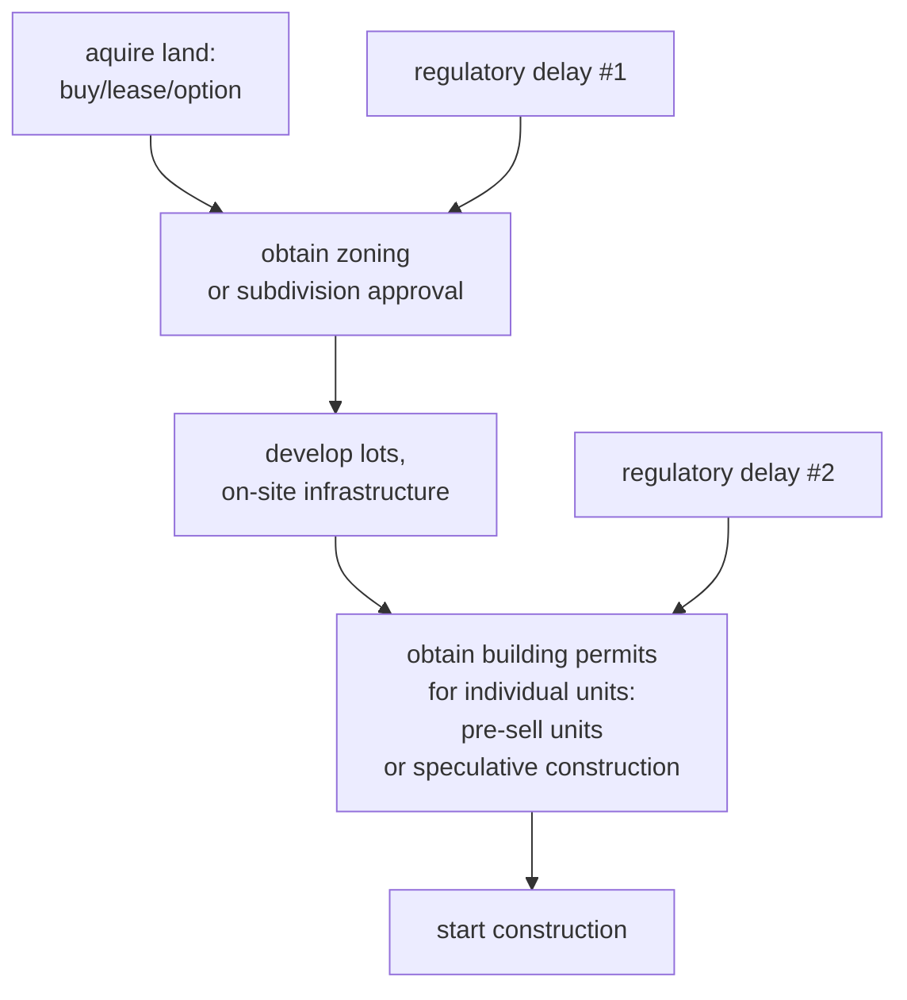
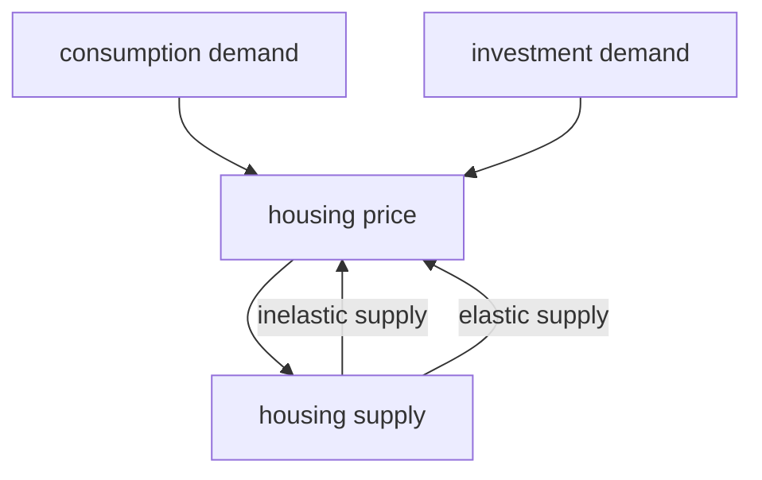

#### State of the Nation's Housing 2023  

Housing wasn't a top priority of hte federal government. There was a perception that housing was affordable in the United States.  

In the past, the consensus was that housing affordability was a local problem.  

Ths is evidenced by the fact that HUD was the weakest cabinet department.  

It used to be tough to be get research grants for housing while it was easier for transportation.  

Low supply of construction workers tying that back to housing crisis (2008).  

Housing market had a boom in early 2000s.  

Lots of changes in american cities. Urban areas have become more popular and land prices have risen significantly.  

Standards for housing have changed:  
-  environmental regulations  
-  construction standards  
-  inclusionary housing requirements (affordable housing requirements)  

How can we also ensure adequate supply of housing for middle class?  

Solution: we have to expand the overall supply of housing.  
Lots of studies saying that zoning and regulations can increase development costs.  

Housing crisis today is the overall undersupply of housing -- not just lower income and localized.  

Process of mfiltering: How long does it taqke? 
-  what are the factors that affect the effectiveness of the flitering process.  
-  supply issue might prevent housing from being filtered at all.  
- there is a filter mechanism, the question is whether or not the filtering is effective.  

Affordability in terms of mortgage costs: need to earn around $110,000 to afford a median price home, as a functino of current interest rates.  

## 2023-09-07
### Today's Topics 
-  why is housing different
-  housing demand 
-  housing supply  

### Why is housing different?  

-  Housing is durable -- it will be used for many years.  
-  Buying and selling behaviors change throughout ones life-cycle  
-  Housing is a basic need  
-  Housing is a heavily regulated sector -- the reason why gov'ts are allowed to do this is because there is a recognition that housing is not just a private good.  
-  Housing is so important that there is a need for the pubic sector to regulate it.  

##### Housing is a public good / social good.  

-  Housing has asset value -- changes in value can be large and can treated as an investment/speculatively  
-  Demand for housing can change over time  
    -  Comparing rust belt cities with areas with newer housing stock.  

For older housing stock you have to think about maintenance.  

-  Housing is fixed in location -- you can't move houses easily.  

### why is housing different (from the slides) 
-  Housing is heterogeneous (houses can differ from each other in many ways)  
-  housing is fixed in location  
-  housing is durable  
-  housing is expensive  

### housing is heterogeneous  
each dwelling offers a different set of features of a differnt bundle of housing services  
-  dwelling characteristics:  
    -  structures and size  
    -  design  
-  site characteristics  
    -  accessibility 
    -  neigh quality  
    -  pub services and taxes  
    -  environ quality  

housing market is a product differentiated market  

#### housing is fixeds in location  
-  neigh quality is very important (externalities)  
-  housing market is segmented  
    -  housing market is a set of overlapping sub-markets differentiated by sixze, location, and quality  
    -  this means supply/demand relationship can be different in each submarket  
    -  housing submarkets are also related: buildings from different sumarkets are impefect subsitutes and households can move between.  

#### housing is durable  
-  most supply comes from existing stock, but the ecisting stock can be upgraded  
-  newly built housing is a small portion of total supply  
-  Naturally occuring afforable housing -- not subsidized.  
-  most of the affordable supply in the us is this type -- housing that has been filtered down.  
-  housing supply is determined not only bt the production decisions of builders of new units, but also by the decisions of excisting propperty owners concerning the conversionj of their units.  
-  new housing is only a small part of the total housing supply, a fundamental reason for the volatility of the development industry. (this is true in the united states)  

#### Housing is expensive  
-  large fraction of households rent instead of owning.  
-  borrowing (mortgage) is needed to purchage a home  
-  most middle-0income household use homeownershpi to avccimulate wealth  
-  need to worry about euity issues, particularly affordability  
-  need to worry about policy failures that may further raise ohusing costs such as overly restrictive regulations.  

#### high transaction costs in housing markets  
-  search costs  
-  legal and admin costs  
-  adjustmetn costs (moving costs)  
-  expectations and uncertainty  
-  financing costs  

has the effect of reducing mobility, wchih has implications on household welfare  

#### housing is both a private and social good  
-  Housing is a private good:  
    -  housing is a consumption good 'consumed' by indiv households. 
    -  housing is an investment good.  
-  housing is a social good:  
    -  housing is joinly 'consumed' by household and their community. the quality of your housing, and your contribution to the neigh caffects your neighbors consummption & utility.  
    -  housing is a basic human need. the right to housing!  
    -  good housing makes good citizens(?)

2-3% of us households live in publkic housing, <10% live in gov't subsidized housing. 

1 out of 4 eligible hosuehold has been able to live in some sort of gov't subsidized housing.  

### fundamentals of housing demand  

#### what being demanded on the housing market?  
-  the stock measure of housing -- the actual structures or housing units  
    -  in the owner-occupied sector, is it the housing units being traded.  
-  the flow measure of hosuing -- housing services.  
    -  in the rental sector, it is housing services being traded.  
    

**hosuing services are heterogenous**  

#### factors affecting housing demand  

-  individual housing demadn is shaped by:  
    -  financial resources of consumers (income and wealth)  
    -  price (user-cost) of ohusing relative to the prices of other goods  
    -  consumers taste for housing  
    -  factors affecting the investment-drive demand  

(first 3 points -- market fundamentals, investment is very different, can come from outside the market and have no relationship to the use of housing at all)  

-  The aggregate market ohusing demand is affected by:  
    -  the total number and types of households  
    -  other factors: political factors, immigration, climate change(!)  

### the housing demand curve  

[put a pic here of demand curves]  

**how sensitive is the change in housign demand in response to privce changes?**

$$
Elasticity = \frac{\Delta{Q/Q}}{\Delta{P/P}}
$$

price elastiticty of housing demand = percentage change in quantity being demanded / percentage change in housing price  

> when housing supply is negative, demand is elastic.  

> **higher income households tend to be more elastic than lower income households**  

### Housing demand and income changes  
-  two types of income:  
    -  permanent income (aka wealth) v.s. current income  
    -  how sensitive is the change in housing deamdn in response to cincome changes?  

> the income elasticity of demand = percentage change in quantity being demanded / percentage change in household income  

##### ( income elasticity of demand tends to be close to 1 )

tldr housing is a normal good.  

### housings demographic demand  

-  what factors affect housings demographic demand ?  
-  is housing's demographic demand independent of housing market conditions?  

## 2023-09-14  

[Southeast Michigan Coalition of Governments](https://www.semcog.org/community-profiles)  
-  they have demogrpahic profiles on their website and other statistics  

Last time:  
-  talked about demand  
-  some issues in housing supply  

### what is being supplied on the housing market?  

Need to distinguish between demand for housing services (rent) and demand for housing ownership.  

-  flow supply of housing services  
    -  how can the supplyo fo hosuing services be changed? 
    -  there are things landlords can do to change the level of housing services (renovations, etc)  
    -  same is true for mismanagement/lack of maintenance (reduce the level of housing qwuality)  
-  the stock supply of housing:  
    -  net additions = new construction - depreciation and demolition  
    -  depreciation: economic depreciation (value declines) _and_ physical depreciation (quality of housing deteriorates)  

> new construction is only a small part of the overall supply  

### housing supply: new housing bs. existing housing  

-  most of the existing housing is supplied through the filtering process:  
    -  housing units trickle down and households move up.  
  
-  if value decreases, rents tend to decrease.  
    -  filter process was fairly evident way of providing affordable housing. this may not be as true anymore.  

>  scarcity increases value of the land, which contributes to rent, while the physical structure of the building may decline.  

-  the supply of new housing depends on the availability of development inputs.  
**Land, labor, materials, and financial services.  

-  How would regulations affect them? How might the development industry respond to this?  

### Housing Supply:  Short-run v.s. Long Run  

-  supply curve in the short run is fixed (vertical supply curve)  
-  in the long run supply is flat (long run)  
-  shifts in demand are much higher frequency, so run up against vertical supply curves (Fixed stock)  

### measuring house supply  
housing supply is measured in a number of ways  
-  rate of new housing construction:  
    -  housing permits  
    -  housing starts  
    -  completions  

Census data on new construction  

-  rate of depreciation of existing housing  
    -  when will housing units stop being used?  
    -  what happens after this?  

> estimates of owner-occupied value depreciate 1.2% per year.  
> estimates of renter-occupied value depreciate 1.4% per year.  

After 50 years or so, housing will only be providing half of it's original value.  

At a certain point, the costs of upkeep and maintenance may exceed the value of the property, so in certain situations there may be abandoned properties.  
-  this happened to detroit and a lot of rust belt cities.  

-  abandoned properties can become contagious  

### Cyclic Nature of new Housing Development  

-  has new housing supply been responsive to housing price change?  
    -  new housing supply = f(housing proce, cost of development inputs)  
    -  basically whether there are profits to be made. if so then you build.  

the long-run price elasticity of new housing production = perdenct change in quantity being produce &div; percentage change in housing price.  

## elastic new housing supply v.s. inelastic new housing supply  

-  people need to consume housing (consumption demand)  
-  but housing is also an asset (investment demand)  
    -  change in interest rates affect investor demand  
    -  when rates are low you can get loans to purchase properties.  
    -  this will increase housing prices.  

-  in elastic supply: housing supply will increase and prices will rise, but only to a small degree.  
    -  pricing will be determined by cost of developments 
-  in inelastic supply: housing supply cannot increase as quickly, and price increases will be much more drastic.  

> what factors affect the price of elasticity of new housing supply?  

### asset price (stock) vs rent (flow)  

$$
p = \sum^T_{t=o}{\frac{R_t = C_t}{(1 + i)^t}}
$$

-  where P is the price of the proper, the present value of future net rental income.  
-  $R_t$ is rent income at time t, 
-  C_t is the maintenance cost ( of the operating cost ) of th eproperty.  
-  i is th einterest rate or discount rate.  
-  t is the list of the asset 

in teh special case where rents and costs are constant over time, and the time horizon is long enouhg:  
$$
P \cong \frac{R - C}{i} 
$$

Here we can call i, the interest rate, as the capitalization rate.  

### data sources on house prices  
-  National Association of Realtors (NAR): median house prices by MSA  
    -  other data available on NAR website.  

### Housing Price  
-  there is no standard unit price observable in the housing market  
-  the housing price/rent we observe measures the **total expenditures** consumers pay for all housing attrivutes n 
-  this also means prices are difficult to compare across locations and time.  
    -  median sale price in one year can differ because different quality houses can sell across different time periods.  

### How can we measure housing price and hence housing quantity?  
-  hedonic price model: enable is to decompose housing prices into measuable attribute prices and quantities.  
-  hedonic price models assume that the market price of a dwelling is hte sum of the prices of the individual components.  
    -  proposed by sherwin rosen (1974)  
-  hedonic equation is a **regression** of expenditures (rents or prices, the dependent variables), on price.  

$$
Y = \beta_0 + \beta_1 x_1 + \beta_2 x_2 + ... + \beta_n x_n
$$
-  $\beta$ are estimated coefficients, reflecting the iplicit prices of each attribute.  
-  dollars/square foot  
-  bedroom size  
-  building age  
-  etc  

> many housing attribute variables are likely to be related to each other (multicolinearity), but there are adjustments that can be made to address that.  

### selection of independent variables  
-  dwelling strucutre variables:  
    -  whatever characteristic you think matters: # rooms, floor area, structure type, age, materials, other features, etc.  
-  neighborhood characteristics  
    -  rating, school quality, socio-economic characteristics.  
-  location within market
-  **date of transaction**: date of sale also can affect price  

### Hedonic price model:  functional form  

no strong theretical basic cfor choosing any specific functional form. both linear or semi-log functions are used. but semi-log function has advantages over the linear form.  

$$
LnY = \beta_0 + \beta_1 x_1 + ... + \beta_n x_n 
$$

-  semi-log functional form allows interpretation of changes in characteristics as percentage changes in price.  

## 2023-09-21

### Why repeat sales approach?  

-  hedonic price models require extensive data, but publicly available sales data often do not contain detailed information about unit attributes.  
-  if some important unit characteristics are ommitted, there could be systematic bias in the estimated model.  
-  repeat sales method can help you aboid this data issue. by tracking only the units that have sold.  

-  is it automatically quality-controlled, as long as there have ben no alterations or renovations to the housing unit between the two (or more) transactions.  

### repeat sales approach  

$$
P_1: \text{price at first sale }; P_2 \text{ price at second sale} \\
D_1: \text{date at first sale }; D_2 \text{ date at second sale} \\

LnP_2 = \Beta_0 + \Beta_1 x_1 + ... + \Beta_n x_n + \alpha_2 D_2 \\
LnP_1 = \Beta_0 + \Beta_1 x_1 + ... + \Beta_n x_n + \alpha_1 D_1 \\  
LnP_2 - LnP_1 = \alpha_2D_2 - \alpha+1D_1 \\
Ln\frac{P_2}{P_1} = \alpha_2 D_2 - \alpha_1 D_1 \\
$$

Knowing $Ln\frac{P_2}{P_1}$, we can estimate the $\alpha_2, \alpha_1$ with transaction data.  

Once estimated, we can construct housing price changes for the entire housing market.  

So:  
$$
\frac{P_2}{P_1} = Exp^{\alpha_2D_2-\alpha_1D_1}
$$

### limitations of the repeat sales approach  
-  can only estimate price changes, not levels  
-  assumes the subsample of homes that sold more than once is representative of all home sales during the period.  
-  assume no change in the quality of the housing unit between the two periods where it is sold.  
-  assumes implicit attribute prices are constant over time so that the attribute prices cancel out in the construction of the housing price index.  

### OFHEO Housing Price Index  
OFHEO = Office of Federal Housing Enterprise Oversight  
-  now named Federal Housing Finance Agency (FHFA)
-  FHFA House Price Index 
-  index developed based on repeat sales  
-  based on transactions involving conforming, conventional mortgages purchased or securitized by fannie mae or freddie mac.  
-  it is based on more that 28.1 million repeat transactions over 29 years.  

### Indicators of local housing affordability: comparative and spatial approach
-  bogdon, amy s. 

-  objectives of the paper:  develop measure to compare affordability across different geographies.  

-  what are the 3 dimensions of housing problems that need to be considered in assessing housing needs?  
    -  overcrowding  
    -  physical adequacy: condition of the unit 
    -  affordability of the unit 

-  what is the state of the housing stock now?  
    -  at the time of the paper (late 1990s), the housing stock was not that old.  
    -  almost 30 years later, the level of replacement of housing stock has not increased, so comparatively the housing stock is older.  

### how to measure housing affordability?  
#### demand side measures: 
percentage of income measure:  
    -  most commonly used is percentage of income spent on housing.
    -  30% of income is a common metric: if a household spends more than 30% of their income on housing, they are considered **cost-burdened**  
-  what are some pros and cons of this measurement:  
    -  measure uses transitory income instead of permanent income.  

Shelter Poverty Measure:  
-  disposable income minus the cost of achieving a minimal standard of non-housing consumption.  

Quality adjusted measure:  
-  number of households where 30% of income would not cover HUD section 8 approved minimum quality standard.  

#### supply side measures:  

vacancy rate:  
-  some people say the natural vacancy rate is aruond 3-4%   

housing affordability mismatch:  
-  ratio of housing units potentially affordable to households earning a certain income to the number of households at that income.  
    -  ratios of less than 1 indicates that there are fewer housing units affordable to households at a specific income range than there are households in that income group.  
-  dollar amount is often the level of housing vouchers using Fair-Market Rent (FMR).  
    -  FMR is average rent for a housing unit of modest quality.  

### housing affordability mismatch  

-  ratio of housing units potentially affordable to households of a certain income range to th4e number of households in htat income range  

$$
\frac{\text{\# of affordable units}}
{\text{\# of households in that income range}}
$$

### National association of realtors (NAR) Housing Affordability Index

-  ratio of 25% of median monthly income to the monthly payment of a conventional mortgage on a median valued house sold.  
-  value of 100 means that by devoting 25% of income to housing, a household of median income has exactly enough income to addord the median house sold.  

## 2023-09-28  

### measuring affordability for homeowners  

-  for homeowners, affordability refers to the ability to afford home mortages. so mortgage terms and amortization schedules are important.  
-  national association of realtors (NAR) housing affordability index
-  national association of home builders (NAHB) housing opportunity index
    -  computes fraction of dwellings sold that could be purchased by the median household with 28% of household income being spent on housing.  

### data to measure housing affordability: census 

-  mandated by the constitution!
-  modern census of population and housing 

### how are the data collected?  
-  collected through a mail survey  
-  in the decennial census, two different census questionnaires are used:  
    -  short form: 100% of households  
    -  long form: 1 in 6 households  
        -  restructured as the american community survey (ACS) in 2005.  
        -  now a continuous survey. 

### four major universes (and units of definition) used in the census  
-  population (person)
-  workers (employed persons over 16)
-  housing (housing unit) 
-  households (occupied housing unit)  

### american community survey  
- acs collects and produces population and housing information every year instead of every 10 years.  
-  about 3 million housing units are sampled each year.  

### ACS: Period estimates  
-  acs estimates are period estimates, decribing the average characteristics ofer a specified period.  
- contrast with a point-in-time estimates of the decennial census data.  

### ACS data schedule  
-  one-year estimates are available for geographies with a population of 65,000 or more, beginning 2005.  
-  3-year estimates are available for geographies with a population of 20,000 or more
-  5-year estimates are available for areas with a population of less than 20,000 

### how to label multi-year estimates  
-  acs estimates based on data collected from 2005-2007 should not be labelled "2006" or "2007" estimates  
-  instead, they should be labelled "2005-2007" estimates.

### margin of error in acs data  
-  a margin of error is the difference between an estimate and it's upper or lower confidence bounds. confidence bounds can be created by adding the margin of error to the estimate (for the upper bound) or subtracting the margin of error from the estimate (for the lower bound).  all published acs margins of error are based on a 90-percent confidence level. (us census bureau, 2008)  

### use multipyear estimates when...  
-  no 1-year estimates are available  
-  margins of error for the 1-year estimates are larger than required  
-  analyzing data for small population groups  

### geographies used in housing research  
-  metropolitan statistical areas (MSAs)  
-  an are containing a large population nucleaus and the nearby communitis that are integrated in an economic sense, with the nuclues. the nucleus is eithr a central city with at least 50, 000 people.  

### MSAs
-  detroit-warren-dearborn, mi
    -  principlar cities: detroit, warren, dearborn

### place  
-  an incorporated municipal unit of government, including villages, cities, boroughs, and in some places "towns" (not to be mistaken for unincorporated towns)  
-  a census designated place, a relatively dense settlement with at least 1000 residents. urbanized but unincorporated.  

### census tract

-  unit close in size to what we think of as a neighborhood.  
-  small, relatively permanent statistical subdivisions of a county. border consisten with county boundary!  
-  usually between 1500 and 8000 persons 
-  census tracts are designed to be relatively homogeneous with respect to population characteristics, economic status, and living conditions.

### block group  
-  a block group is a cluster of census blocks, a maximum of 97 blocks.  
-  block groups generally contain between 600 and 3000 people, with an optimum size of 1500 people.  

### block  
-  basic geographic level. average 85 persons.  
-  bounded on all sides by visible features such as streets, roads, streams, and railroad tracks, and by nonvisible boundaries such as city, town, township, and county limits, and short line-of-sight extensions of streets and roads.  
-  confidentiality must be maintained, and data about individual persons and households are not revealed.  

## 2023-09-28  
### introduction to housing finance  

-  why do we need a mortgage?  
-  recourse loan: if defaulted, liability applies to all the assets a borrower has.  
-  no-recourse loan: if defaulted, lender can take back property, butr has no recourse for other assets  

before the last housing crisis, most mortgage loans were non-recourse loans.  

### some important features of mortgage products  
-  loan-to-value ratio  
-  down payment  
    -  in the us, typically 20% down payment, 80% financed.  
-  loan amount  
-  interest rate  
-  debt service coverage ratio
    -  used for income-generating commercial properties: ratio of net operating income divided by the debt service (loan payments + interest)
    -  commonly DSR used is 1.25%
-  points  
    -  additional finance charges that are used to increase the yield of a mortgage.  
    -  1 point = 1% of the loan amount.  
    -  points are paid at closing of a mortgage loan. 
-  Annual Percentage Rate (APR)  
    -  the cost of credit expressed as a yearly rate

-  FHA: federal housing administration
    -  created to encourage home purchases for people who could not afford 30% down payment.  FHA provides mortgage insurance to these types of borrowers -- typically first-time buyers.  

### what risk factors affect mortgage contract design?  
-  interest rate risk: mortgage loans in the us are typically for 30 years
-  default risk: some borrowers may not be able to repay the loan.  
-  prepayment risk: borrowers may pay off the loan ahead of schedule.  
    -  for borrowers, prepayment can be a good thing, for lenders it can be negative because they lose out on stable interest payments over the longer term.  
    -  in the us, prepayment is free. in other countries there are often prepayment penalties  
-  inflation rates  
-  liquidity for securitization: most lenders will sell their loans on the secondary market.  
-  affordability to borrowers  
-  tax and regulatory factors  

### fixed rate mortgages  
-  FRM is a fully ammortizing, constant payment mortgage.  
-  the monthly payment includes interest and some repayment of the principal  
-  at the end of the term, the original term amount, or principal, is completely repaid, or fully ammortized. the lender has earned a fixed rate of interest on a monthly loan balance. 
-  FRM is used extensively in financing single-family homes (in the us) and in long-term lending on income-producing properties.  

### history  
-  before the FRM, there were only interest-only loans.  
-  frms were developed in the 1930s  
-  IO loans were popular in the 1920s, with all of the payments going towards interest, with a balloon payment at the end of the loan term.  
-  IO loans were popular because they were easy to understand, and the balloon payment was often refinanced.

During the great depression, the housing market collapsed, and when balloon payments came due, many people had to default on their mortgages. 
-  this led to the creation of the FHA, specifically to insure and popularize fixed-rate mortgages.  

### risk characteristics of frm  
-  some affordability risks  
-  high interest rate risk  
-  low default risk  

## 2023-10-05  
### adjustable rate mortgages (ARMs)  
-  ARMs are a type of mortgage loan characterized by interest rates that adjust or fluctuate periodically based on a preselected index.  
-  the interest rate on an ARM is tied to a specific index, such as the treasury bill rate, the 11th district cost of funds index, or the london interbank offered rate (LIBOR).  

### Other types of mortgages  
-  balloon mortgages  
    -  a balloon mortgage is a loan that is amortized over a longer period than the term of the loan.  
    -  at the end of the term, the entire remaining balance is due.  
    -  balloon mortgages are typically used for commercial properties.
-  interest-only mortgages
-  reverse mortgages  
    -  a reverse mortgage is a loan that allows homeowners to convert part of the equity in their homes into cash without having to sell the home, give up title, or take on a new monthly mortgage payment.  
    -  reverse mortgages are available to homeowners 62 years of age or older.  
    -  the homeowner's obligation to repay the loan is deferred until the owner dies, the home is sold, or the owner leaves the home.  
    -  the amount of equity that can be converted to cash is based on the age of the youngest borrower, the interest rate, and the lesser of the appraised value of the home, the sales price, or the FHA mortgage limit for the area.  
    -  reverse mortgages are typically used by older homeowners to supplement retirement income.  

### subprime v.s. predatory lending  
-  subprime: lending to borrowers with high credit risk who are not eligible for prime loans.  
-  predatory: lending to borrowers and steering them into loans with high interest rates, regardless of their credit quality.  

### Major entities in the us housing finance system  
-  FHA: federal housing administration
-  Fannie Mae: federal national mortgage association
-  Freddie Mac: federal home loan mortgage corporation
-  Ginnie Mae: government national mortgage association
    -  only purchases FHA and VA loans.
    -  only agency that is backed by the full faith and credit of the us government.
    -  Fannie mae and freddie mac are not "supposed" to be backed by the full faith and credit of the us government, but they are.
-  FHFA: federal housing finance agency

## readings for 2023-10-09

### group project part II
- policy memo on housing strategies 
- due dec 4th 
- 2-3 pages 

### final paper 
- due dec 7th 
- 10-15 pages 
- mostly review paper to look at the literature
- focused study of a particular housing topic: 
    - why is it important 
    - review literature and analyze what we know and don't know about the topic 
        - what needs to be studied more 
- more info on the syllabus 

### 

Gregg Colburn (2021) The use of markets in housing policy: a comparative analysis of housing subsidy programs, Housing Studies, 36:1, 46-79.

Michael J. Rich. 2014. Community Development Block Grants at 40: Time for a Makeover, Housing Policy Debate, 24:1, 46-90.
