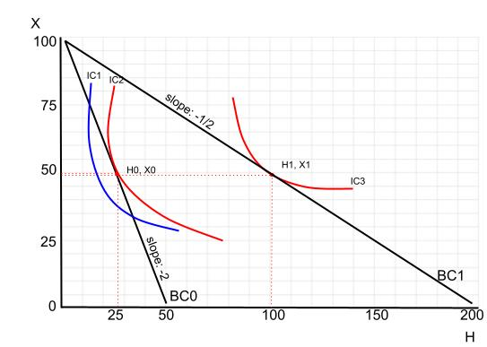
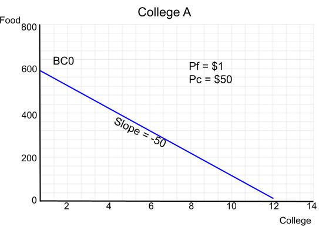
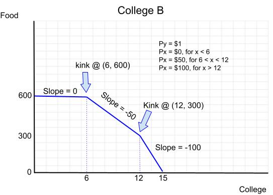
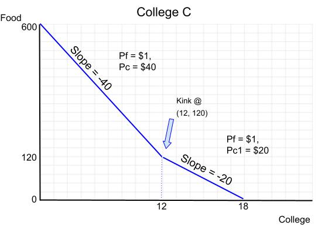

```{r setup, include=FALSE}
knitr::opts_chunk$set(echo = TRUE)
library(dplyr)
library(ggplot2)
```
  
Public Policy 555: Microeconomics A
Fall 2023, Professor Kevin Stange
Budget Constraint Assignment
Handed out: September 14, 2023
Due: September 21, 2023 at 11:59pm  

### **Instructions**
Upload an electronic copy of the assignment to Canvas. You can type up your answers or write
them by hand and upload a pdf containing photos of your work. If you go this route, please just
upload a single pdf file and please make your writing is legible. If an answer is difficult to read,
it will be difficult to grade!


### Question 1. Health Care  
1. Suppose individuals choose between two normal goods: health care visits (H) and a composite of all other goods (X). Initially the price of health care services is PH = \$2 and the price of all other goods is normalized to Px = \$1. Each person’s income is \$100.  
a.  On the graph below, draw the budget constraint, labeling the intercepts and slope. Healthcare is on the x-axis. Label this $BC_0$.  
b.  Depict indifference curves representing the preferences over these two goods for a typical person. Indicate the utility-maximizing bundle given this budget constraint and label this point $H_0$ and $X_0$ on the graph.  

c.  Now suppose the State of Michigan implements a health care subsidy that lowers the price of health care from \$2 to \$0.50. Draw the new budget constraint on the same graph, labeling the intercepts and slope. Label this $BC_1$.  
d.  Indicate the utility-maximizing bundle given this new budget constraint and label this point $H_1$ and $X_1$ on the graph.  

  

e.  Which of the following statements are true? Circle all that apply.
-  **The subsidy will always increase the number of health care services (H)**
-  The subsidy will always decrease the number of health care services (H)
-  The subsidy will not impact the number of health care services (H)
-  The subsidy will always increase the consumption of other goods (X)
-  The subsidy will always decrease the consumption of other goods (X)
-  The subsidy will not impact the consumption of other goods (X)  

f. Explain your answer to part (e) above in terms of income and substitution effects  

The substitution effect will cause demand to increase when the price of a good decreases. When a subsidy is offered for healthcare, the price goes from \$2 to $0.50, so a consumer seeking to maximize their utils will demand more of it. Because health care is a normal good, the income effect says that because the effective price decreased, it acts as if effective income increased, allowing additional consumption of health care.  

g. If the policy goal was to increase the number of people that received at least one health care visit, do you think that a broad-based subsidy for all health care visits (like that described above) or simply making the first visit free for everyone would be more effective? Explain your reasoning using the indifference curve & budget constraint framework we’ve been using.  

Above, a broad-based subsidy caused a rotation in the budget line. This scenario would still allow situations where some consumers might prefer to spend all of their money on other goods, as opposed to healthcare. If the goal was to make sure that everyone had at least 1 health care visit, creating a program where the first visit is free would reduce the cost to \$0, pushing out the budget line to 1 unit of healthcare. A consumer whose preference would be to still use all their income on other goods could still access that bundle if they wanted to without sacrificing their maximum utility.  

h. Describe one important influence on health care utilization that is not captured by this simple economic model.  
This model assumes that health care is accessible to all consumers in the market. If health care visits are far, or only open and accessible from 9 to 5 when people are otherwise occupied, their preferred bundle of health care and other goods may not be possible.  

### Question 2: College Pricing
Cora is choosing between three different colleges that have very different pricing structures. She has \$600 to spend on food (F), whose price is equal to \$1, and college credits (C), whose price varies across colleges. Note that in the U.S., undergraduate students typically take 6 to 15 credits per semester. Taking 6 credits is considered half-time and 15 credits is typically needed to graduate on-time within four years.  

1. For each college described below, draw a budget line to illustrate the budget constraint Cora would face. Illustrate your answers with a separate graph for each subpart. Your graphs should have **F on the vertical axis and C on the horizontal axis.** For each graph, label all intercepts, slopes, and "kink" points (if appropriate).  

a) College A: Flat price of \$50 per credit (regardless of how many credits)  

  

b) College B: First 6 credits are free (\$0), the next 6 are \$50 each, any credits beyond 12 are \$100 each.  



c) College C: First 12 credits are \$40 each. Any additional credits beyond 12 are \$20 each.  




2. At which college would you expect the most students would be attending at least half time (taking at least 6 credits). Explain with reference to the budget constraints. 

Most students would enroll part-time at College B. Because of the subsidy, students can consume their optimal amount of food without worrying about their budgets and still be enrolled in college at least half-time. This means that consumption of college would increase for those who would normally spend all their money on food.  Their budget constraint is pushed out relative to without the subsidy, allowing a higher amount of consumption.  

3. At which college would you expect the most students would graduate early, by taking more than 15 credits per term? Explain with reference to the budget constraints.  

Most students would enroll in more than 15 credits per term at College C. The "bulk discount" given to credits past 12 means that the students experience an increase in income relative to the price of college credits. Their budget line rotates outward past the 12th credit, inducing more consumption.  
