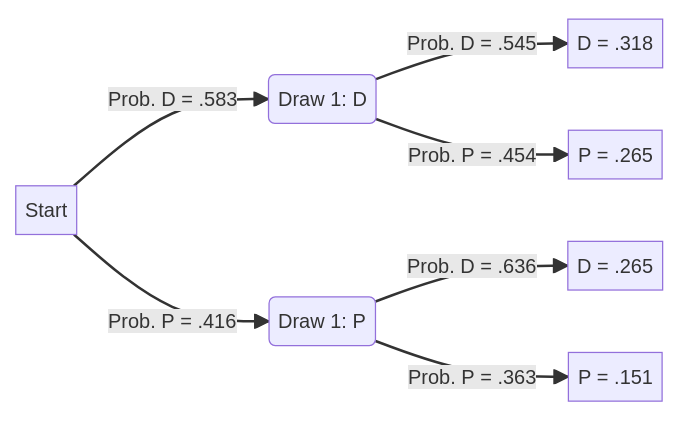

```{r setup, include=FALSE}
```
Due Tuesday, September 26  

Please show your work for all problems if possible, or describe your steps/logic.  

1. The random variable X takes on the values listed below with the given probabilities:  

$$
X = 
\begin{cases}
1 & \text{ with probability .1}\\
2 & \text{ with probability .4}\\
3 & \text{ with probability .2}\\
4 & \text{ with probability .3}\\
\end{cases}
$$
  
Suppose that Event A = {1, 3}. Event B = {3, 4}.  

(a) What is $E[X]$ (in other words, the expected value of X)?  
The expected value of X is the sum of all of the possible values multiplied by the probability of those values.  

$$
E[X] = \mu_x = \Sigma xP(x)
$$
```{r}
(1*.1) + (2*.4) + (3*.2) + (4*.3)
```
  $E[X]$ = 2.7  

(b) What is $E[(X - \mu x)^2]$ (in other words, the variance of X)?  
To find the variance of X, we take each x subtracted by the mean and square the result, then multiply that value by it's probability. Then we sum all of those values. 

$$
E[(x- mu_x)^2] = [(1 - 2.7)^2*(0.1) + (2 - 2.7^2)*(0.4) + (3 - 2.7^2) *(0.2) + (4 - 2.7)^2 *(0.3)]
$$
```{r}
 ((1 - 2.7)^2 * (0.1)) +
 ((2 - 2.7^2) * (0.4)) +
 ((3 - 2.7^2) * (0.2)) +
 ((4 - 2.7)^2 * (0.3))
```

(c) What is P (A and B)? Show your work.  
A = {1,3} and B = {3,4},  so A $\cap$ B = {3}  
So:  
P(A $\cap$ B ) = P(1) = .2    

(d) What is P (A or B)? Show your work.  
A = {1,3} and B = {3,4}, so A $\cup$ B = {1,3,4}  
So: 
P ( A $\cup$ B ) = [P(1) + P(3)] + [P(3) + P(4)] - P(3)  

```{r}
(0.1 + 0.2) + (0.2 + 0.3) - 0.2
```


(e) What is P (~A and ~ B)?  
A = {1,3} and B = {3,4}, so ~A $\cap$ ~B = {2}  
So: P(~ A and ~B) = P(2) = 0.4  

2. Suppose that, to save time, the admissions office for Ohio State University decided to just admit students randomly. Each applicant is admitted with probability .7. Consider a sample of four applicants.  

(a) What is the probability that all four applicants are accepted?  
Since each student has the probability of 0.7, you need to multiply all the probabilities together to get the joint probability of all 4 being accepted.
P(A and B and C and D) = P(A) * P(B) * P(C) * P(D)
```{r}
(0.7 * 0.7 * 0.7 * 0.7)
# or 
(0.7)^4
```

So the probability is 0.2401  

(b) What is the probability that just one of the four applicants is accepted?  
Using the binomial formula:  
x = 1 success
n = 4
p = 0.7


$$
P(X = x) = \frac{n!}{x!(n - x)!}p^x (1 - p)^{(n - x)}
$$
Subbing in our values:  
$$
P(X = 1 \text{ acceptance }) = \frac{4!}{1!(4 - 1)!}(0.7)^4 (1 - 0.7)^{(4 - 1)}
$$
Simplifying: 
$$
P(1 \text{ accept}) = \frac{4!}{1! 3!}(0.7)^4(0.3)^3 
$$
$$
=  \frac{4 \cdot 3 \cdot 2 \cdot 1}{1 \cdot (3 \cdot 2 \cdot1)} \cdot (0.2401) \cdot (0.027)  \\ 
$$
$$
= 4 \cdot (0.2401) \cdot (0.027)  \\
$$
$$
= 0.0259
$$


(c) What is the probability that at least three applicants are accepted?  
In the same way, you can calculate all scenarios in which at least 3 applicants are accepted. 
P(at least 3) = P(3) + P(4)  
P(4) = .2401   
Using the binomial formula:  
$$
P(X = x) = \frac{n!}{x!(n - x)!}p^x (1 - p)^{(n - x)}
$$
Where:
x = 3 acceptances 
n = 4
p = 0.7

$$  
P(X = 3) = \frac{4 !}{3! (4 - 3)!} (0.7)^3(1 - 0.7)^{(4 - 3)} 
$$   
Simplifying:  
$$
P(X = 3) = \frac{4 \cdot 3 \cdot 2 \cdot 1}{3 \cdot 2 \cdot 1 (1)}(0.343)(0.3) \\ 
$$
$$ 
= 4 \cdot (0.343)(0.3) \\ 
$$
$$
= 0.4116 \\
$$

3. Suppose you have a jar with 12 quarters in it. Seven were minted in Denver (marked D), five were minted in Philadelphia (P). You draw a quarter at random and note the outcome: D or P. You then draw a second quarter without replacing the first one. It will likely be helpful to make a probability tree diagram representing this scenario to
help you answer the questions below.  



(a) What is the probability of at least one quarter marked D?  

P(DD or PD or DP) = P(.583 * .545) or P(.416 * .636) or P(.583 * .454)  
```{r}
DD <- (7/12) * (6/11)
PD <- (5/12) * (7/11)  
DP <- (7/12) * (5/11)
DD + PD + DP
#PP <- (5/12) * (4/11)
```

(b) If the first quarter is P, what is the probability the second one is D?  

To get the probability that the second quarter is D, take the conditional probability given P. 

$$
P(D | P) = \frac{P(D\cap P)}{P(P)} \\
$$
$$
=  \frac{(0.416)(0.636)}{0.416} \\
$$
$$
= 0.636
$$

(c) Suppose you have not drawn a quarter yet. With what probability will the second quarter be P?  

There are two possibilities here: PP, and DP. So we can add the two probabilities together to get the probability that the second quarter will be P. 

```{r}
DP <- (7/12) * (5/11)
PP <- (5/12) * (4/11)
DP + PP 
```


4. A researcher uses the 2014 General Social Survey to explore whether handgun ownership and beliefs about the afterlife are related. She obtains the following joint frequency distribution for beliefs about life after death and the respondent's handgun ownership. Some respondents refused to answer the question.  

| Belief in Life After Death? | Owns Pistol or Revolver?  |          |         |       |
|---------------------------|-------------------------|----------|---------|-------|
|                           | Owner                   | Non-Owner | Refused | Total |
|-------------------------- |------------------------ |--------- |-------- |------ |
| Yes                       | 274                        | 885         | 48         | 1,207       |
| No                        | 54                         | 237          | 5         | 296       |
|-------------------------- |------------------------ |--------- |-------- |------ |
| Total                     | 328                         | 1,122          | 53         | 1,503       |

Suppose that you are drawing a person at random from this sample.  

(a) Calculate P (Yes).  
```{r}
1207/1503
```
  
(b) Calculate P (Yes | Owner).  
```{r}
274/328
```
  
(c) Calculate P (Yes | Non-Owner).  
```{r}
885/1122
```
  
(d) Are these two variables, belief in life after death and handgun ownership, independent? Explain.  
When two variables are independent, the conditional probability is the same as the unconditional probability.  
$$
P(A|B) = \frac{P(A\text{ and }B)}{P(B)} = P(A) 
$$
A = Yes, B = Owner  
P( A and B ) = P(Yes | Owner) = 0.835  
P(B) = P(Owner) = 0.218  
P(A) = P(Yes) = 0.803
```{r} 
# p(a and b)
274/328
# p(b)
328/1503
# P(a)
1207/1503
```
Because P(Yes|Owner) != P(Yes), we know that at least one conditional probability does not match the unconditional probability, so it's likely that these two variables are not independent. 