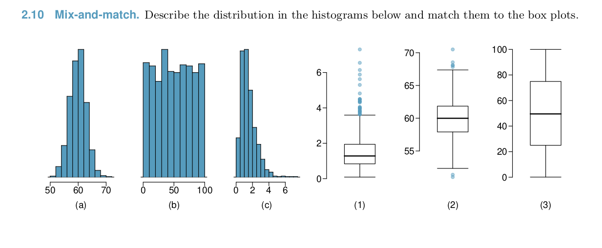

```{r setup, include=FALSE}
knitr::opts_chunk$set(echo = TRUE)
library(tidyverse)
library(patchwork)
```

## Exercises

### 2.10  



#### (a)  
2  

#### (b)  

3  

#### (c)  

1  

### 2.13  

  

The bimodal nature of the distribution is more apparent in the histogram than in the box plot. The long tail of outliers is more apparent in the box plot.  

### 2.14  **Facebook friends.**  Facebook data indicate that 50% of Facebook users have 100 or more friends, and that the average friend count of users is 190. What do these findings suggest about the shape of the distribution of number of friends of Facebook users?  

The median number of users have 100 or more friends. The mean number of friends is 190. When the mean is greater than the median, that is an indication that the distribution is right-skewed, with larger values creating a longer right tail.  

### 2.17  

  

#### (a) Would the mean or the median best represent what we might think of as a typical income for the 42 patrons at this coffee shop? What does this say about the robustness of the two measures?  

The median is a better representation of the typical income for the 42 patron sample. The median is less affected by outlier values such as the 2 people making over $200,000. The median rose from (1) to (2) from 65,240 to 65,350, while the mean rose 65,090 to 73,300. This means that median is a more robust metric than the mean.  

#### (b) Would the standard deviation or the IQR best represent the amount of variability in the incomes of the 42 patrons at this coffee shop? What does this say about the robustness of the two measures?  

The standard deviation rose from 2,122 to 37,321, which indicates lots of variation in the observations. However when you look at the IQR, you can see that the range of the majority of the records is much smaller. The IQR changes from `r 66160 - 63620` to `r 66540 - 63710`. This indicates that the IQR is more robust to outliers than the standard deviation.  

### 2.18 **Midrange.** The midrange of a distribution is defined as the average of the maximum and the minimum of that distribution. Is this statistic robust to outliers and extreme skew? Explain your reasoning.  

This statistic would not be robust to outliers, because a large maximum value would pull the midrange higher. For example, the midrange in sample 1 above is: `r (69890 + 60680)/2`, while in sample 2 the midrange is: `r (60680 + 250000)/2`. The midrange more than doubles.  

### 2.27  **Make-up exam.** In a class of 25 students, 24 of them took an exam in class and 1 student took a make-up exam the following day. The professor graded the first batch of 24 exams and found an average score of 74 points with a standard deviation of 8.9 points. The student who took the make-up the following day scored 64 points on the exam.  

#### (a) Does the new student's score increase or decrease the average score?  
The new student's score will decrease the average score.   

#### (b) What is the new average?  
The new average will be 73.6   
```{r}
((24*74) + 64) / (24 + 1)
```

#### (c) Does the new student's score increase or decrease the standard deviation of the scores?  
The new score is slightly more than one standard deviation below the mean, so it is not an extreme outlier, and the new mean is 0.4 points lower. This implies that the new standard deviation will increase slightly.  

### 2.28 **Infant mortality.** The infant mortality rate is defined as the number of infant deaths per 1,000 live births. This rate is often used as an indicator of the level of health in a country. The relative frequency histogram below shows the distribution of estimated infant death rates for 224 countries for which such data were available in 2014.  


#### (a) Estimate Q1, the median, and Q3 from the histogram.  
Q1: 25, Median: 20, Q3: 50  

#### (b) Would you expect the mean of this data set to be smaller or larger than the median? Explain your reasoning.  
The mean is likely higher than the median because of the long right tail. These larger values and potential outliers bring up the overall average, but the median is more robust to outlier values.  

### 2.31  **Oscar winners.** The first Oscar awards for best actor and best actress were given out in 1929. The histograms below show the age distribution for all of the best actor and best actress winners from 1929 to 2018. Summary statistics for these distributions are also provided. Compare the distributions of ages of best actor and actress winners.  

  

On average the actors were around 7 years older than the actresses. The distribution of actress winners has a higher standard deviation, indicating more spread in the data. It looks like there are a couple of large outliers in the actor data, based on the bars in the far right hand side of the chart around 80. Both distributions show a right skew.  

## Computing Questions

```{r}
data <- read_csv('hw1_data.csv')
```

#### Plot each variable using a histogram and a boxplot. Describe the distributions of var1 and var2.

```{r}
var1hist <- ggplot(data) + geom_histogram(aes(var1))
var2hist <- ggplot(data) + geom_histogram(aes(var2))
var1hist / var2hist
```

Var 1 is bimodal in distribution. The values range from about 50 to around 140.  
Var 2 has a more unimodal distribution. The range is from -30 to a little bit over 20.  

```{r}
var1box <- ggplot(data) + geom_boxplot(aes(var1))
var2box <- ggplot(data) + geom_boxplot(aes(var2))
var1box / var2box
```

Var 1 has an IQR range of 120 to around 70 (50 units). The median of var 1 is a little over 95.
Var 2 has a smaller IQR and a tighter distribution. The median of var 2 looks to be around -1.


#### What type of plot do you think best illustrates each distribution? Why?  

The histogram is more useful for showing the distribution of the data in var 1. Relying only on the boxplot would obscure this about var 1. Because var 2 has a more unitary distribution and longer tails, the boxplot is appropriate to illustrate the spread of the data.  

#### Compute descriptive statistics for each variable. Use what you know about the distributions of the variables to decide which descriptive statistics are most appropriate.

```{r}
bind_rows(summary(data$var1),
          summary(data$var2)
) %>% knitr::kable(row.names = TRUE)

```

Because of the large range for both variables, it makes sense to report the median, which is less affected by large outliers, to get a sense of the central tendency of the values. It would also be useful to report the minimum and maximum of each variable to show the range of the data.  

