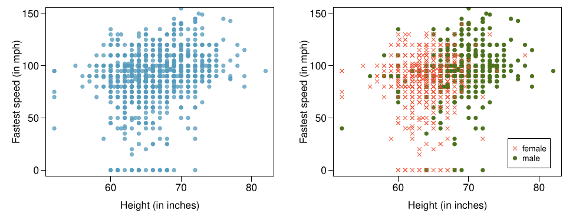

  
```{r setup, include=FALSE}
knitr::opts_chunk$set(echo = TRUE)
library(tidyverse)
library(patchwork)
```

## Exercises


### 2.22 **Views on immigration.**  

910 randomly sampled registered voters from Tampa, FL were asked if they thought workers who have illegally entered the US should be (i) allowed to keep their jobs and apply for US citizenship, (ii) allowed to keep their jobs as temporary guest workers but not allowed to apply for US citizenship, or (iii) lose their jobs and have to leave the country. The results of the survey by political ideology are shown below.  

| Response                           | Conservative | Moderate | Liberal | Total |
|:---------------------------------:|:------------:|:--------:|:-------:|:-----:|
| (i) Apply for citizenship         |      57      |   120    |   101   |  278  |
| (ii) Guest worker                 |     121      |   113    |   28    |  262  |
| (iii) Leave the country           |     179      |   126    |   45    |  350  |
| (iv) Not sure                     |      15      |    4     |    1    |   20  |
| **Total**                         |    **372**   | **363**  | **175** | **910** |

#### (a) What percent of these Tampa, FL voters identify themselves as conservatives?  

```{r}
372/910
```

(b) What percent of these Tampa, FL voters are in favor of the citizenship option?  

```{r}
278/910
```

(c) What percent of these Tampa, FL voters identify themselves as conservatives and are in favor of the citizenship option?  

```{r}
57/910
```

(d) What percent of these Tampa, FL voters who identify themselves as conservatives are also in favor of the citizenship option? What percent of moderates share this view? What percent of liberals share this view?  

```{r}
cons <-57/372 
cat('conservative: ', cons)
lib <- 101/175
cat('liberal: ', lib)
```

(e) Do political ideology and views on immigration appear to be independent? Explain your reasoning.  

No. If the political ideology and views on immigration were independent, we would expect the proportion of people supporting the citizenship option to be roughly the same across all political identities.  

### 2.32 **Exam scores.**  

The average on a history exam (scored out of 100 points) was 85, with a standard deviation of 15. Is the distribution of the scores on this exam symmetric? If not, what shape would you expect this distribution to have? Explain your reasoning.  

Because the mean is 85, which is closer to 100, and the standard deviation is 15, the range within 1 standard deviation is between 55 and (bounded at) 100. This implies a left-skewed distribution, not symmetric.  

### 2.34  **Marathon winners.**  

The histogram and box plots below show the distribution of finishing times for male and female winners of the New York Marathon between 1970 and 1999.  

  

#### (a) What features of the distribution are apparent in the histogram and not the box plot? What features are apparent in the box plot but not in the histogram?  

In the histogram you can see that the times have a bimodal distribution. In the boxplot you can see that the median is around 2.4 and the times are clustered around the median.  

#### (b) What may be the reason for the bimodal distribution? Explain.  

It's possible that there is a separate mode for men's times and women's times.  

#### (c) Compare the distribution of marathon times for men and women based on the box plot shown below.  

  
  
  
The men's distribution of times is clustered tightly around the median of 2.2. The women's time distribution has a larger range, and the median is higher around 2.5.  

### 8.4 (specify the direction, strength, and shape of the association)  

  

#### (a)  

Moderate negative relationship, specifying a linear model would not be appropriate.  

#### (b)  

Moderate positive relationship, specifying a linear model would not be appropriate.  

#### (c)  

Strong positive relationship, specifying a linear model would be appropriate.  

#### (d)  

Weak positive relationship, specifying a linear model may be appropriate.  

#### (e)  

Weak negative relationship, specifying a linear model may be appropriate.  

#### (f)  

Moderately strong negative relationship, specifying a linear model may be appropriate.  

### 8.6 **Exams and grades.**  

The two scatterplots below show the relationship between final and mid-semester exam grades recorded during several years for a Statistics course at a university.  

  

#### (a) Based on these graphs, which of the two exams has the strongest correlation with the final exam grade? Explain.  

The second exams appear to have a stronger correlation with the final exam grade. The predicted score based on the line of best fit is closer to the actual scores. There are fewer outliers.  

#### (b) Can you think of a reason why the correlation between the exam you chose in part (a) and the final exam is higher?  

It's possible that the students were less prepared for the first exam or less accustomed to the exam style. By the second exam students would have been able to prepare more appropriately for the expected level of study required to do well on the exams.  

### 8.7 Match the correlation, Part I.  
  

#### (a)  
4  

#### (b)  
3  

#### (c)  
1  

#### (d)  
2  


### 8.9 **Speed and height.**  

1,302 UCLA students were asked to fill out a survey where they were asked about their height, fastest speed they have ever driven, and gender. The scatterplot on the left displays the relationship between height and fastest speed, and the scatterplot on the right displays the breakdown by gender in this relationship.  

  

#### (a) Describe the relationship between height and fastest speed.  

As height increases, the responses to the fastest speed ever driven increases. The relationship is weakly positive.  

#### (b) Why do you think these variables are positively associated?  

It's possible that taller drivers are older and have spent more time driving, and have had more opportunities to speed.  

#### (c) What role does gender play in the relationship between height and fastest driving speed?  

It looks like in general both genders have similar top speeds, but the male gender group is taller overall.  

### 8.25 **Murders and poverty, Part I.**  

The following regression output is for predicting annual murders per million from percentage living in poverty in a random sample of 20 metropolitan areas.  

  

|                  | Estimate | Std. Error | t value | Pr(>|t|) |
|------------------|----------|------------|---------|----------|
| (Intercept)      | -29.901  | 7.789      | -3.839  | 0.001    |
| poverty%         | 2.559    | 0.390      | 6.562   | 0.000    |

**Model Summary**

- s = 5.512
- $R^2$ = 70.52%
- $R^2 Adj.$ = 68.89%

#### (a) Write out the linear model.  

$$
Murders = -29.901 + 2.559(poverty\%) 
$$

#### (b) Interpret the intercept.  

At 0% poverty, on average the predicted number of annual murders per million would be -29.901.  

#### (c) Interpret the slope.  

A 1-unit change in the percentage of people living in poverty, the annual murders per million increases by 2.559.  

(d) Interpret $R^2$.  

The $R^2$ is 70.52%, and the adjusted $R^2$ is 68.89%. This number represents the proportion of variance that is explained by the independent variable. In this model the around 70% of the murder rate is "explained" by the percentage of people in poverty.  

(e) Calculate the correlation coefficient.  

The correlation coefficient is the square root of the $R^2$.  
```{r}
R_sq <- 0.7052
r <- sqrt(R_sq)
print(r)
```


Computing Questions:  

Use R and the dataset hw1_data.csv. 

### (1) Create a plot that summarizes the bivariate relationship between the variables. In one complete sentence, how would you describe the relationship between var1 and var2.  

```{r, message=FALSE}
data <- read_csv('hw1_data.csv')
ggplot(data) + 
  geom_point(aes(x = var1, y = var2))
```

It looks like var1 and var2 have a very weak relationship.  

(2) Compute a descriptive statistic to quantify the relationship between var1 and var2.
In just one sentence, describe how the value of this summary statistic is consistent with the description of the relationship you gave based on the graphical representation above.  

To quantify the relationship between the two variables by calculating the correlation coefficient. You can do this in R using the `cor()` function.

```{r}
var1 <- data$var1
var2 <- data$var2
correlation <- cor(var1, var2)
print(correlation)
```

The coefficient is `r correlation`. This implies a weak negative relationship between var1 and var2. However, looking at the scatterplot, it is not clear there is a linear relationship. It's possible that the variables have a non-linear relationship.  
