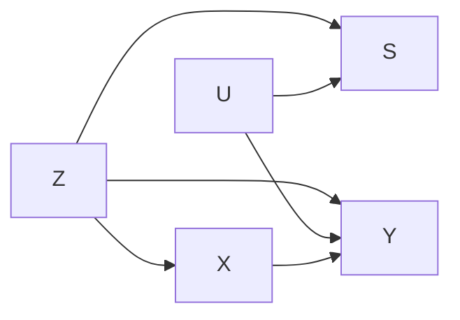

## 2024-09-23

### Sample Selection and Related Models

Outline:
1. Preliminaries
2. Selection Bias
3. Selection Models
4. Endogenous Treatment Effect Models

### Problems from Non-Random Selection

Either people in the sample are not randomly assigned or the people in treatment are not randomly assigned.
When sample/treatment selection is not random, the relationships we observe betweenvariables may not be representative. 

1. The process that brings cases into our sample yields cases that do not represent the full population of interest.  
    - the data are censored or truncated.

2. Assignment into the treatment condition (e.g participation in the program) is engogenous with key explanatory factors.  

Under these circumstances, our coefficients may be biased unless we can find a way to account for this selection process.  

### Example: Rural Developlemt Policy in Vietnam
- Do and Park (2019) study whether the New Rural Development (NRD) program in Bietnam is raising household incomes. 
- The NRD was designed at the central government level. Implementation is at the level of the commune.
- Implementatoin involved meeting 19 criteria in five categories:
    - planning,
    - socioeconomic indicators,
    - infrastructure,
    - etc.

### NRD Study, Continued

- Although program was mandatory for all communies, adoption was not universla.
- In theory, then, we can evaluate the NRD by comparing outcomes for communes that adopted it to those that did not.  
- Problem: Communes that adopted the NRD might have "different social, economic and natural conditions."

### Study Design
- Use government surveys to provide data for 1205 commuies on a range of factors
- Dependent variable: average household income **for the 507 communes that participated in the NRD program**.
- Independent variables: roads, internet access, medical staff, mechanization of agriculture, gov. development loans.
- The estimated coefficients might be biased because key unobserved factors affect both adoptiona of NTD and income. 
- Use Heckman Selection Model to account for this bias.

### Basis of the Heckman Model

- There are two parts: 1) a model of selection into the sample; 2) a model for the outcome.  
- The first is a probit (selection is dichotomous); the second can be a linear regression or a probit/logit
- The model of selection provides information about unobserved factors that affect both selection and the outcome of interest. 
- We incorporatethis information into the outcome model to correct bias in it's coefficients.

### Vietnam NRD Program
- Key: the selection equation must contain at least one variable not in the outcome equation.
- The model for whic hcommunes adopted the NTD includes geographic, social, economic, and political predictors: 
    - remote geographic location, household poverty rate, age of commune leaders, population, number of cooperatives.
- Outcome equation, a linear model of average household income, includes mostly indicators of key NRD components.
- Of the 1,205 communes in the selection model, 507 appear in the outcome model.  

### Results

(See slides for results table)

### Some Interpretation
- Both equations are estimated simultaneously via MLE. The parameter `rho` estimates correlation between their disturbances.
- The coefficients for the outcome stage can be interpreted like OLS, since it is a linear model.
- e.g. more roads, health personnel, and agricultural mechanization are associated with higher average household income. 
- The coefficients for the selection stage can be interpreted like those of a probit model.
- e.g. commuies in remote areas are more likely to adopt the NRD, while those with a higher poverty rate are less likely.

### Some assessment and critique

- in theory, the appraoch corrects coefficients in the outcome model for selection bias.
- the idea is that it controls for unmeasured factors that affect both NRD adoption and effectiveness.
- Question: Why is there not income data for the communes that did not adopt the NRD to use in comparison?
- the Heckman selection model meant for scenarios where the outcome of interest is not observed in the control cases.
- Perhaps the study has confused endogenous treatment assignment with endogenous sample selection.  

### Selection Bias
- the term "selection bias" is used a bit too loosely to refer to a range of different phenomena that have different causes.
- in general, the sample is not representative of the population of interest due to systematic factors.
- the apply the best remedy, however, we have to think carefully about why the sample is not representative.
- unfortunately, just saying that there is "selection bias" does not provide any guidance. 

### Different phenomena

- *Endogenous treatment assignment*: occurs when treatment is correlated wiht observed and/or unobserved factors that affect the outcome of interest.
- *endogenous sample selection*: occurs when there is at least one unobserved factor that affects both whether the outcome is observed and the value of the outcome if observed.

### Endogenous Treatment Assignment

```mermaid
graph LR
Z[Observed Confounding Factors] --> X[]
Z --> Y[]
X --> Y
U[Unobserved Confounding Factors] --> X
U --> Y
```
- Our interest is in the effect of X on Y. An observed confounding factor Z affects both X and Y.
- An unobserved factor U also affects both X and Y, and we can't control for it in regression.
- Potential solution is instrumental variable analysis or endogenous treatment effect regressions.

## e.g. Endogenous Treatment Assignment

- For example, suppose we are trying to estimate the returns to a college education.
- Here the "treatment condition" is a dichotomous variable that indicates whether a person has a college degree.
- we estimate the coefficient on this variable, controlling for other factors that affect earnings.
- *Problem*: a person's decision to attend college may be correlated with whether a college degreew will pay off for that person.
- Our coefficient is likely biased because it does not account for this non-random selection.

### Endogenous sample selection

- The factor S is a dichotomous indicator of whether Y is observed at all for a particular case. 
- There are unobserved factors (U) that affect both S and the value of Y.
- Thus our sample is unrepresentative of our population of interest for reasons that are connected with the outcome. 



### e.g. Endogenous Sample Selection
- We want to know the effect of education and work experience on earnings, so we estimate a regression model.
- But what if people entere the workforce only if their earnings would be greater than some reservation wage?
- Our sample would be truncated. We only observe earnings of those for whom this threshold is crossed.
- Our estimate of the effects of education and experience wold be biased; our sample does not reflect the population of interest.

### Problems from missing data
We may perceive endogenous sample selection as a problem with missing data on Y.

There are two major categories of missing data: 
- *Random*: If data are missing at random, OLS is still unbiased and consistent. There is some efficiency loss, however.
- *Systematic*: 
If data are missing for reasons that are non-random, then the consequences depend on specific factors.

### Systematic missing data for Y

**Selection bias (endogenous sample selection)**: occurs when the cause of missing data is related to what we are studying.

- there is some reason that was are missing obsercations on Y.
- we get biased and inconsisten parameter estimates.
- e.g. graduate school admissions, effect of state capacity  on economic growth, effect of education on wages.

### when does this bias emerge?
- there are unobserved factors that help determine whether y is observed for each case, as well as the value of y when observed.
- this may produce correlation between the observed x's and the stochastic term.
- if we fail to control for these factors, we may get biased coefficients on included independents variables.
- this is a form of omitted variable bias.

### Example: Graduate School Admissions

- applications for graduate school may exhibit qualities that are not easliy measured by scores (college GPA, test scores, etc.).
- good admissions committees notice these qualities.
- these qualities thus correlate with both admission into graduate school and performance once in graduate school.
- models omit these unmeasured qualities and thus may get biased coefficients on included variables like GPA or test scores.
- i.e. students who are accepted despite lower GPAs are unrepresentative of the low-GPA population; we have missing data on how the students not accepted would have performed.

### Selection models, setup
there is a linear model* that predicts outcome $Y_i$ in terms of the X's: 
$$
Y_i = \beta_0 + \beta_1 X_{1} + \beta_2 X_{2} + \ldots + \beta_k X_{k} + \epsilon_i
$$

There is also a selection model in which a latent variable Z* determines whether a case appears in the sample.
$$
Z*_j = \gamma_0 + \gamma_1 X_{1} + \gamma_2 X_{2} + \ldots + \gamma_k X_{k} + \nu_j
$$

The $\gamma$'s are coefficients in this model; the w's are explanatory variables' the parameter $\nu_j$ is a stochastic term.

* the outcome model for $y_i$ can also be a probit or logit model.

### Selection models, setup continued

We observe $y_i$ if $z_i = 1$, which depends upon the value of $z*_j$.

$$
z = 1 \text{ if } z*_j > 0 \\
z = 0 \text{ otherwise}
$$

This is familiar, as it is a probit equation.
$$
Pro(z_i = 1) = \phi(w_i \gamma)
$$

### Selection models, setup continued
- Imagine we multiplied both sides of the linear regression equation by $z_i$.
$$
z_i y_i = z_i (\beta_0 + \beta_1 X_{1} + \ldots + \beta_{k-1} X_{k-1} + \epsilon_i)
$$

- Since $z_i = 1$ or 0, this equation is no different than what we estimate.
- What about the usual assumption the $Cov[x_i, \epsilon_i] = 0$? **We now need $Cov[z_i x_i, z_i \epsilon_i] = 0$**.
- If $z_i$ is a function of factors that are correlated with $\epsilon_i$, the assumption will be violated.

### What does that mean? (page 29)

[todo: finish notes from here]