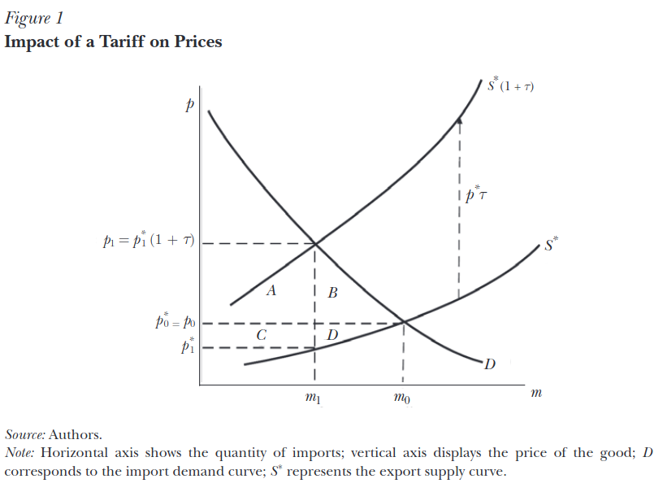

```{r setup, include=FALSE}
knitr::opts_chunk$set(echo = TRUE)
```

Public Policy 558: Economic Analysis in the Practice of Public Policy
Winter 2025
Professor Kevin Stange

## Question 1
State whether each statement below is True or False and briefly explain your answer in a short paragraph.  

### a) "Suppose a consumer experiences a price increase due to a policy change. If you were to provide this consumer with additional income equal to their compensating variation for this price change, they will return to their original consumption bundle."  

False. Compensating variation is the additional income that will return a consumer to their original level of **utility**, not necessarily the original amount of consumption.  

### b) Payroll taxes in the U.S. are split equally by firms and workers (they are taken directly out of your paycheck). This means that workers and firms equally split the incidence of these taxes.  
False. The incidence of a payroll tax depends on the elasticity of demand for labor.  

### c) "Compensating variation can be approximated by the change in total surplus."  

False. Compensating variation is approximated by consumer surplus.  

## Question 2

Recall the DC paid family leave policy. Suppose the inverse labor demand curve by DC firms is given by: $W =70 – 30H$ and the inverse labor supply curve by DC workers is given by $W = 5 + 35H$, where W is the wage and H is the quantity of hours worked (measured in billions). Suppose the labor market is competitive and there are no distortions.  

### a) What is the equilibrium price (wage) and quantity (hours)? What is the total payroll (wage x hours)?  

Quantity of Labor supplied: $W = 5 + 35H$  
Quantity of Labor demanded: $W = 70 - 30H$  

To find the equilibrium hours:  

$$
\begin{aligned}
& 5 + 35H = 70 - 30H \\
& 5 + 35H + 30H = 70 \\
& 5 + 65H = 70 \\
& 65H = 70 - 5 \\
& 65H = 65 \\
& H = \frac{65}{65} = 1 \\
\end{aligned}
$$
To find equilibrium price (wages), plug $H$ into the inverse labor demand curve:  

$$
\begin{aligned}
& W = 70 - 30H \\
& W = 70 - 30 (1) \\
& W = 40 \\
\end{aligned}
$$
Total Payroll:  
$$
W * H = 40 * 1 = 40
$$
Remembering hours are in billions = $40 billion.  

### b) What is the consumer surplus, producer surplus, total surplus, and DWL at this equilibrium?  

To find consumer (employer) surplus, take the area of the upper triangle:

$$
\frac{1}{2}(1*(70-40)) = 15
$$
Consumer surplus: \$15 billion.  

To find producer (labor supply) surplus:  

$$
\frac{1}{2}(1*(40-5)) = 17.5
$$
Producer surplus: \$17.5 billion.  

Total surplus is $15 + 17.5 = 32.5$. There should be no dead weight loss at this wage and hour combination because the market is in equilibrium.  

### c) What is the elasticity of labor supply, computed at the equilibrium?  

The formula for the elasticity of labor supply is:  

$$
E_L = \frac{\Delta H}{\Delta W} \cdot \frac{W}{H}
$$

Using the slope of the labor demand curve and plugging in the equilibrium wage rate and hours:  

$$
E_L = \frac{1}{35} \times \frac{40}{1} \approx 1.14
$$

### d) To fund the Paid Family and Medical Leave program, the district imposes a \$1 tax on each hour of work by DC employees. Note that this tax is different than the actual tax imposed for the program, which was 0.62% of payroll. This actual tax was also an ad valorum (rather than unit) tax and also much smaller in magnitude than a \$1 per hour tax. The tax must be paid by DC employers. Assuming no change in behavior (hours worked), how much revenue would the tax raise? This is the approach of the Fiscal Impact Statement.  

Assuming no change in behavior, the tax would raise \$1 billion: 1 billion hours x \$1 tax.  

### e) Calculate the new equilibrium quantity (hours) with this tax.  

The tax is paid by employers, so incorporating that into the labor demand function:  

$$
W = 70 - 30H - 1 = 69 - 30H
$$

To calculate the new equilibrium price, the labor supply function does not change:  
$$
\begin{aligned}
& 5 + 35H = 69 - 30H \\
& 5 + 65H = 69 \\
& 65H = 64 \\
& H = \frac{64}{65} \approx 0.985
\end{aligned}
$$
So the new quantity of labor demanded would be 985 million hours.  

### f) What is the new equilibrium wage that workers receive? What is the wage that employers must pay, inclusive of the tax they pay to the government?  

To find the wage workers receive, plug H into labor supply:

$$
\begin{aligned}
& W = 5 + 35H \\
& W = 5 + 35 \times 0.985 \\
& W = 39.48 \\
\end{aligned}
$$
Employers pay the tax, so add \$1 to that wage: 40.48

### g) Accounting for any change in behavior, how much did the tax actually raise?  

At this price of labor, employers only demand 985 million hours, multiply by \$1 for the tax = \$985 million dollars.  

### h) What is the incidence of the tax on workers?  

As a result of the tax, wages decreased from 40 to 39.48, implying that workers bore .52 cents of the tax.  

### i) What is the incidence of the tax on employers?  

Employers pay \$40.48 after the tex, implying that they bear .48 of the tax above the equilibrium wage.  

### j) What is the new consumer surplus? Producer surplus? Deadweight loss?  

Consumer (Employer) Surplus:  

$$
\begin{aligned}
& CS = \frac{1}{2} \times 0.985 \times (69 - 39.48) \\
& CS = \frac{1}{2} \times 0.985 \times 29.52 \\
& CS = 14.539 \\
\end{aligned}
$$
Producer (Labor) Surplus:  
$$
\begin{aligned}
& PS = \frac{1}{2} \times 0.985 \times (39.48 - 5) \\
& PS = \frac{1}{2} \times 0.985 \times 34.48 \\
& PS = 16.981 \\
\end{aligned}
$$
Total Surplus: $ TS =  PS + CS = 14.539 + 16.981 = 31.52$  

To calculate dead weight loss:

$$
\begin{aligned}
& DWL = \frac{1}{2} \times (1 - 0.985) \times (40.48 - 39.48) \\
& DWL = \frac{1}{2} \times 0.015 \times 1 \\
& DWL = 0.0075 \\
\end{aligned}
$$

### k) Assuming that a job is 2000 hours per year, how many jobs are lost (if any) from the tax?  

At the new tax level, employers demand 980 million hours. At 2000 hours per job, this equates to 490,000 jobs. In the no-tax scenario, employers demand 1 billion hours, which translates to 500,000, so the tax could result in the loss of 10,000 jobs.  

### l) Now suppose that labor supply is fixed at the quantity you found in part a. How would your answers to questions h and i change?  

With a fixed supply of labor, workers would be unable to adjust their hours supplied in response to price. As a result, the incidence of the tax falls entirely on labor at whatever price.

## Question 3

### In this question, you will assess how the effects of the tax depend on the elasticity of supply, which is something about which there is considerable uncertainty. The spreadsheet Assignment1.xlsx contains a (very!) simple simulation model of the market described in Question 2. For each given hourly wage rate, the columns give the labor demand, labor supply, and the difference between the two. Equilibrium is the wage at which supply equals demand.  

In the baseline scenario, with an elasticity of 1.14, wages decrease from \$40.00 in the no tax scenario to \$37.30 at a \$5 tax, while total full-time jobs remain at 500,000. This suggests that employers absorb a portion of the tax burden due to the somewhat elastic nature of the labor supply. In contrast, when the labor supply is inelastic (elasticity of 0.5), workers bear more of the incidence, evident from wage reductions and decreasing jobs. With \$1 tax, the wage decreases to \$39.27, slightly reducing jobs to 495,000. A \$5 tax further decreases the wage to $36.35, with employment dropping to 477,500 jobs.

In a highly elastic scenario (elasticity of 2), workers are more responsive to wage changes, leading employers to bear a smaller portion of the tax incidence relative to the changes in labor supply. With a \$1 tax, the equilibrium wage is \$39.60, and total jobs are 490,000. A more substantial \$10 tax significantly reduces the wage to \$36.00, causing jobs to fall to 400,000. Below is a table showing outcomes in each elasticity scenario:  

| **Scenario**       | **Elasticity** | **Tax Rate** | **Equilibrium Wage** | **Total Jobs (Full-time)** |
| ------------------ | -------------- | ------------ | -------------------- | -------------------------- |
| **Baseline**       | 1.14           | $0           | $40.00               | 500000                     |
|                    |                | $1           | $39.46               | 500000                     |
|                    |                | $2           | $38.92               | 500000                     |
|                    |                | $5           | $37.30               | 500000                     |
| **Inelastic**      | 0.5            | $1           | $39.27               | 495000                     |
|                    |                | $5           | $36.35               | 477500                     |
| **Highly Elastic** | 2              | $1           | $39.60               | 490000                     |
|                    |                | $10          | $36.00               | 400000                     |

## Question 4  

The figure below is from Amiti, Mary, Stephen J. Redding, and David E. Weinstein. 2019. "The Impact of the 2018 Tariffs on Prices and Welfare." Journal of Economic Perspectives, 33 (4): 187-210, illustrating the welfare consequences of import tariffs.  



### a. Briefly explain what the areas A, B, C, and D correspond to.  

- A: Incidence of the tariff on consumers.  
- B: Consumer dead weight loss -- not consumed because of higher import prices.  
- C: Incidence of the tariff on foreign producers.  
- D: Foreign producer dead weight loss.

### b. Under what conditions does the tariff benefit the home country (the one imposing the tariffs) as a whole? Refer to the areas indicated on the curve above.  

Tariffs will benefit the home country when foreign producers bear a larger incidence of the tariff, represented by the area of C, than the dead weight loss to the home consumer, represented by area B. This would happen in a scenario where the foreign supply is less elastic.  

### c. Describe a scenario where the tariffs are unambiguously bad for the home country. What conditions might give rise to this scenario?  

In a scenario with perfectly elastic export supply, the supply curve for the imported is horizontal. This would result in an increase in costs only for US importers and increased prices for consumers.  

### d. What variables do you need to be able to measure in order to measure the effect of the tariffs on welfare in the home country, assuming the demand curve is linear?  

- Change in foreign producer prices, before and after the tariff  
- Change in import quantities, before and after the tariff
- Tariff rate
