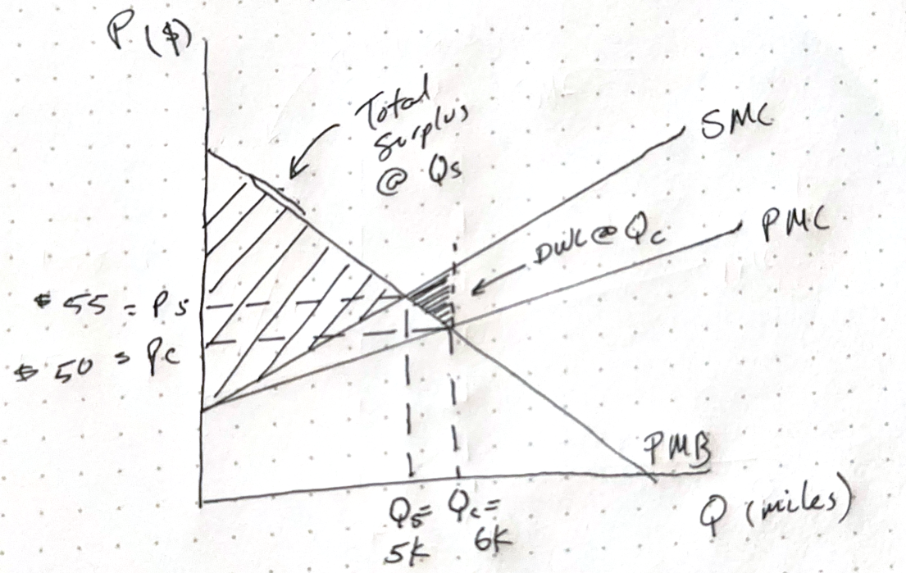

```{r setup, include=FALSE}
knitr::opts_chunk$set(echo = TRUE)
```

## Question 1  

Consider a vehicle miles traveled (VMT) tax—a policy of charging motorists based on how many miles they have traveled. For example, an onboard vehicle device might be used to capture the distance driven by a vehicle through GPS or other technology, and then the government collects from drivers a specific tax per mile driven.  

In the market for miles driven by car, the private marginal benefits of miles driven by car are PMB = 80 – Q/200, and the private marginal costs of miles driven are PMC = Q/200 + 20. Here, the vertical axis is in terms of cents (US currency) and the horizontal axis (quantity) is in miles.  

### a) There are several different types of externalities associated with driving. First, let’s focus on pollution. The marginal external costs to the environment per mile driven are estimated to be:  MEC = Q/500. Calculate the competitive (Qc) and socially optimal level of driving taking into account the externalities from pollution (Qs). Draw a well-labeled graph including all relevant lines ("curves").  

Competitive Q:  

$$
\begin{aligned}
& PMB = PMC \\\
& 80 - \frac{Q}{200} = \frac{Q}{200} + 20 \\\
& 60 = \frac{Q}{100} \\\
& Q_c = 6000 \\\
& P_c = \frac{6000}{200} + 20 \\\
& P_c = 50 \\\
\end{aligned}
$$

Socially Optimal Q, where Social Cost = PMC + SEC  
$$
\begin{aligned}
& SMB = SMC \\\
& 80 - \frac{Q}{200} = \frac{Q}{200} + \frac{Q}{500} + 20 \\\
& 60 = \frac{Q}{200} + \frac{Q}{500} \\\
& Q_s = 5000 \\\
& P_s = \frac{5000}{200} + \frac{5000}{500} + 20 \\\
& P_s = 55 \\\
\end{aligned}
$$


### b) Shade in the total social surplus from driving the socially optimal number of miles. Shade in the deadweight loss (DWL)--the negative social surplus--when the equilibrium level of driving does not take into account the external costs.  



### c) If the government were to implement a specific VMT tax (this is a tax per mile driven), what is the optimal amount of the tax using only the information in this problem so far? Include the tax in your graph (by drawing the new supply curve with the graph). What happens to the negative surplus from the externality with this tax in place?  

To find the optimal tax, you need the amount that reduces the miles driven to the socially optimal level. Since the marginal environmental cost adds Q/500 to the cost curve, we can calculate what that additional cost is at the socially optimal level to determine the price of the tax:  

$$
\begin{aligned}
& Q_s = 5000 \\\
& SEC = \frac{Q}{500} \\\
& Tax = \frac{5000}{500} \\\
& Tax = 10 \\\
\end{aligned}
$$

### d) Some state or city VMT tax proposals charge higher taxes during rush hour. What driving-related externality would charging rates at different times of day help? Answer in just a few sentences.  

Higher taxes for driving during more congested times would allow the state or city to incentivize less driving during specific times of the day. This could lead to less congestion during rush hours and faster commutes. For the people who need to drive during those times, the costs would be worth the price, i.e. revealed preferences show they have a willingness to pay to drive during those hours.  

### e) Conceptually, how would you determine how much higher the tax should be during rush hour relative to other times of day? Answer in just a few sentences.  

The tax should be high enough to discourage the those who don't need to drive at that specific time. One way to achieve this would be to try to estimate the number of cars that create enough traffic that would constitute an externality, and then price a VMT tax to price enough cars out during rush hour.


### f) Would it make sense from the standpoint of a corrective tax to charge more for larger vehicles? If so, briefly explain and include the specific externality story you have in mind. Answer in just a few sentences.  

If larger cars means commercial vehicles, than it does make sense to charge a higher tax. These cars have a less elastic demand for driving than other private cars on the road. This would raise revenues for the municipality, while discouraging more price sensitive drivers from getting on the roads during rush hour. They would substitute driving for other forms of transport, or schedule drives outside of rush hours.  

## Question 2  

Before answering this problem, you should read (skimming much of it is ok) the 20 page report by the Congressional Budget Office (CBO) "Alternative Approaches to Funding Highways" (March 2011) linked on the course outline page. The CBO is a nonpartisan agency that produces economic analysis to support the US Congressional budget process.  

### a) In a few sentences, state why a vehicle miles travelled (VMT) tax is theoretically more efficient than a gas tax--particularly in terms of reducing externalities related to driving.  

Instituting a VMT could better align the costs of road usage, such as wear on roads, construction, and maintenance costs to the actual drivers utilizing the roads. In addition, current taxes on fuel and other vehicle taxes do not accurately cover the environmental or social (congestion) costs of driving.  

### b) The report assesses the extent to which fuel taxes and VMT taxes are regressive or disproportionately burdensome to lower income people relative to resources. (A tax is regressive when the percentage of income spent paying for that particular tax is higher for someone in a lower income bracket compared with someone with a higher income). Briefly summarize the report's findings on how the two types of taxes compare in terms of level of regressivity. Note that part of this assessment involves comparing the differential impact of each type of tax on rural and urban people.  

VMT tax could disproportionately affect rural and poorer drivers. Due to a history of segregation and underinvestment in transit for urban poor, these drivers may have access to fewer transit alternatives, and thus face more costly trade-offs between driving and other forms of transport. 
For rural populations distance between necessities could increase the impact of a VMT. For many rural poor, the trade-offs between driving and other forms of transit are even higher than in dense urban areas.  
Because of long distances faced by rural drivers, and the absence of alternative transit options, a fuel tax seems like it would be more regressive, disproportionately impacting less transit-connected rural poor.  

## Question 3 (Excel-related)  

Recall the proposed runway extension at the Ann Arbor Airport we discussed in class (and read the article "Ready for Takeoff?" if you haven't already). Suppose that with the current runway the marginal private cost (MPC) is equal to 10+0.1Q, where Q is the number of operations (take-offs + landings) measured in thousands. The runway extension should improve safety for the pilots and allow larger planes to operate at capacity (more fuel, passengers, and cargo), which can be thought of as reducing the MPC to 5+0.05Q. Suppose demand is given by the inverse demand curve P = 25 – 0.2Q and that demand is unaffected by the runway. [Throughout don’t think about pilots who fly with no passengers – they are both consumers and producers in the market.]  

### a) Calculate the price, quantity, consumer surplus, and producer surplus both before and after the runway extension. Parts (b), (c), (d) and (e) should be done in Excel. Use as inputs all the parameters described below and the quantities and surplus before and after that you calculated in part (a). You should include a print out of your spreadsheet showing your work for all three parts. We are providing a sample spreadsheet you can use/modify as you see fit.  

Before Extension: 

$$
\begin{aligned}
& Demand: P = 25 - 0.2Q \\\
& MPC = 10 + 0.1Q \\\
& 25 - 0.2Q = 10 + 0.1Q \\\
& Q = 50 \\\
& P = 15 \\\
& CS = \frac{1}{2} \times (25 - 15) \times 50 = 250 \\\
& PS = \frac{1}{2} \times (15 - 10) \times 50 = 125 
\end{aligned}
$$
After Extension:  
$$
\begin{aligned}
& Demand: P = 25 - 0.2Q \\\
& MPC = 5 + 0.05Q \\\
& 25 - 0.2Q = 5 + 0.05Q \\\
& Q = 80 \\\
& P = 9 \\\
& CS = \frac{1}{2} \times (25 - 9) \times 80 = 640 \\\
& PS = \frac{1}{2} \times (9 - 5) \times 80 = 160 
\end{aligned}
$$


### b) Neighbors who live near the airport are concerned about several externalities associated with the airport (and its expansion), particularly added noise, more fatal accidents, and more collisions with Canadian geese. Using the following parameters, determine the total externality cost both before and after the runway extension. Assume that these features are not part of the MPC curves and also assume (for now) that these parameters are the same before and after the runway extension.  

- Number of collisions with geese: 1 goose for every 10,000 operations  
- Number of human fatalities: 0.001 for every 10,000 operations
- Number of "noise disruptions": 100 for every 10,000 operations  
- Value of a goose life: $5,000  
- Value of a human life: $1 million  
- Cost of every noise disruption: $10  

### c) What is the value of the tax per runway operation that would result in the socially efficient level of runway operations?  
### d) The runway extension will cost the government $300,000. Calculate the Benefits minus Costs of the expansion (relative to no expansion). Benefits include any change in CS/PS in the market for takeoffs/landings (part a) and any change in externalities
(part b). The only cost to consider is the direct project construction cost. You should find that the project passes a cost-benefit assessment.  

### e) There is a lot of uncertainty about the parameters in part (b). In particular, residents are worried that the number of human fatalities per 10,000 operations might actually go up because of the new runway's proximity to homes. Determine if the project benefits still exceed the costs if this rate increases as in the following scenarios:  

1. 0.01 for every 10,000 operations  
2. 0.02 for every 10,000 operations  
3. 0.03 for every 10,000 operations  
4. 0.04 for every 10,000 operations  

Do this by creating different scenarios with different values for this parameter.