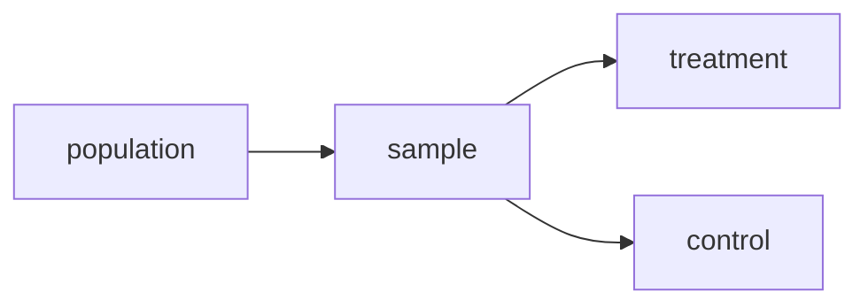
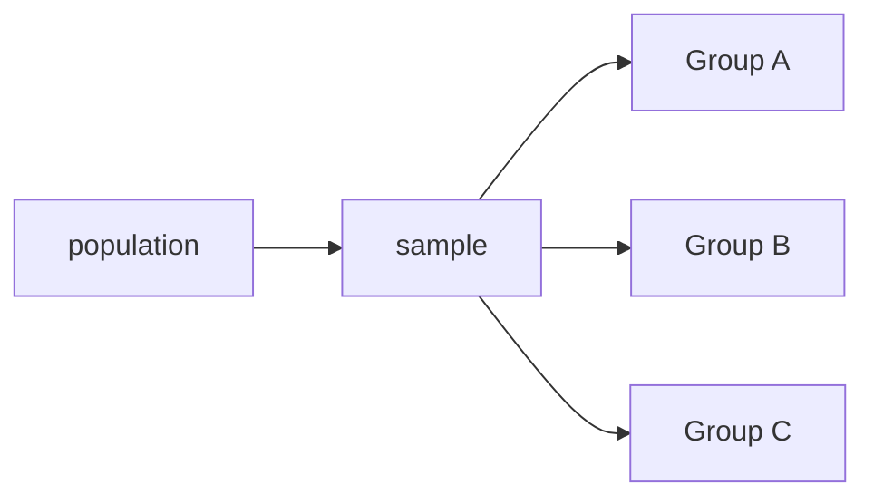

## 2023-10-23  

### Experiments and Causality  

Outline: 
1. causality 
2. experiments and observational studies
3. mean comparison tables 
4. comparison of means tests  

### dependent vs independent variables
$$
x \rarr y
$$

Dependent variable: outcome of interest. affected or determined by other variables.

independent variable: varible thqta we think is doing the causing.  affects the dependent variable -- usually denoted by x.

### conditios for causality

1. variable covary (i.e. when one moves, the other tends to move)
2. change in x preceds change in y. temporal element. 
3. alternative causes are eliminated 

### when correlation is not what we think  

-  spurious correlation: a third factor, an alternative/confounding variable, explains both x and y. 
-  reverse causality: y causes x.
-  simultaneity: x and y are jointly determined (e.g. they cause each other)  
    -  larger process in which x and y are embedded.  

### example  
-  children in smaller classes tend to do worse on standardized tests, even after controlling for demographic variables.  
-  partly due to the fact that struggling children are sometimes sorted into smaller classes

### to make a causal inference  

need to eliminate alternative explanations.  
-  use control variables": we hold constant the value of some other variable that might be an explanation
-  another way is through the use of experimental framework.

we also need theory: logical reasons to believe that a causal relationship exists between x and y.  

### the experiment as an ideal form  
randomized, controlled trials (RCTs) have been heralded as the ideal form for identifying causal relationships between variables.  

-  control of the independent variable  
-  pre- and post-measurement of the dependent variable  
-  exclusion of confounding (alternative) factors through randomization.  

### experiments 

### intro to potential outcomes framewwork 

-  for any case in the data, there are two potential outcomes: 
-  $Y_i(1)$: outcome under the treatment condition
-  $Y_i(0)$ outcome under the control condition  

-  to identify the causal effect of the treatment, we would like to know the outcome under both conditions.  

-  but we can only observe one f these outcomes; the other is a counterfactual scenario.  

effect of the treatment = $Y_i(1) - Y_i(0)$ 

> this is called the fundamental problem of causal inference.  

### benefits of randomization 

- randomization of the treatment, in theory allows us to estimate the Average Treatment Effect (ATE) across the cases.  

-  randomization means allthe other factors that matter should be evenly balanced across the treatment and control groups  

-  thus the expected difference between the potential outcomes can be estimated by the difference between observes outcomes.  

$$
ATE = E[Y_i(1) = Y_i(0)] = E[Y_i(1)] - E[Y_i(0)] = \bar{y_1} - \bar{y_0} 
$$

> The mean for the treatment group represents what would be the mean for the control group, had it been treated, and vice-versa!  

### good experimental design yields  

-  internal validity: isolation of the effectiosn of the independent variable on the dependent variable  
-  external validity : the ab ility to generalize beyond the experiment to other settings.  

### limits to experimentalism  
-  some experiments are not possible for the types of questions we want to answer.  
-  we can instead perform observational studies in which we take whatever data the world gives us.  
-  the basic goal is the same.  

### observational studies  

we want to create comparison groups with different values of the independent variable. then test whether the dependent variable also differs across groups.  

### limitations of observational studies  
-  makgin comparison groups "as alike as possible" without randimozation is very difficult.  
    -  confounding factor s may be responsible for differences that we observe.  
    -  these confounding factors may be observed or unobserved.  
-  lack of control over the independent variable reduces ability to make a causal claim  

### mean comparison table  
-  used when 1 variable, typically $y$ is interval level.  

| category of x | mean of y | frequency |
| --- | --- | --- |
| value 1 | $\bar{y_1}$ | % cases (n of cases)  |
| value 2 | $\bar{y_2}$ | % cases (n of cases)  |
| value 3 | $\bar{y_3}$ | % cases (n of cases)  |
| Total | $\bar{y}$ | 100% (n of cases)  |

### what about statistical significance?  
-  we can see that the means are different
-  but can we reject the null hypothesis of no difference?  
-  previously, we tested for the difference between a sample statistic and a fixed hypothesized value.  
-  we now test for the difference between two sample statistics, both of which are estimated with error.  

### adding the standard errors  
we can perform a t-test to test the difference between two means.

### comparison of means test  
-is the difference between two groups statistically significant?  
-  we use our tools to test whether we can reject the null hypothesis (of no difference between the two groups)  
-  differences of means do not establish causality, they only help identify whether a difference exists 

-  a causal inference comes from experimental design and/or theory  

### a reminder of asumptions  

-  are these masures reliable and valid?  
-  is the sample random and representative  
-  are the comparison groups, with the exception of the independent variable, identical?  

## basics 

$$
H_0 = \mu_2 - \mu_1 = 0 \\
H_a: \mu_2 - \mu_1 \neq 0
$$

Note: set up so it stays positive.  
> the difference of means has a standard error  

### the standard error of the difference  
-  since both means have sampling error, the difference of means has two sources of  standard error.

-  the standard error of the difference is a function of the standard error for each mean,  
the formula for the standard error depends on whether the samples are independent or dependent  

### independent vs. dependent samples  

independent samples: the observations 

### general formula: independent samples 

standard error of the difference: $\sqrt{(se_1)^2 + (se_2)^2}$

$$
= \sqrt{(\frac{s_1}{\sqrt{n_1}}) + (\frac{s_2}{\sqrt{n_2}})} 
$$

$$
= \sqrt{
    \frac{s_1^2}{n_1} + \frac{s_2^2}{n_2}
} 
$$

## the big picture  
we're interested in whether there is a difference between means between two populations: $\mu_1$ and $\mu_2$  
-  we estimate the difference using samples to obtain $\bar{y_1}$ and $\bar{y_2}$
-  To make this work we need to calculate a standard error.  
-  we test whether this statistic is different from $H_0$ with sufficient confidence.  

### Standard error: difference of means 

we already know this formula:  
$$
se of \bar{y} = \frac{s}{\sqrt{n}}
$$

Plug it into the formula for the se of the difference:  
$$
\text{se difference } = \sqrt{(se_1)^2 + (se_2)^2} \\
= \sqrt{(\frac{s_1}{\sqrt{n_1}})^2 + (\frac{s_2}{\sqrt{n_2}})^2} \\
= \sqrt{\frac{s_1^2}{n_1} + \frac{s_2^2}{n_2}}
$$

### confidence interval for the difference 

now that we know the standard erorr, we can make a confidence interval:  
$$
ci = (\bar{y_1} - \bar{y_2}) \pm t_{df} * \sqrt{\frac{s_1^2}{n_1} + \frac{s_2^2}{n_2}}
$$

As always, we need to choose a t or z statistic for the desired level of confidence and degrees of freedom. 

### degrees of freedom: independent samples 

-  when working with one sample mean, the degrees of freedom was n - 1  
-  we are now working with the means from two samples. calculating the degrees of freedom is more complicated.  
    - the maximum possible degrees of freedom is: $df = n_1 + n_2 - 2$
    -  the minimum degrees of freedom is: $df = min(n_1 - 1, n_2 - 1)$  

the "true" degrees of freedom depends on the relative sample sizes and sample variances. if they are exactly the same, we get the maximum possible df.  

### degrees of freedom: independent samples  
** note: we don't need to memorize this **

if the variances of the sample are unequal, the formula is quite complex (the software will handle it)  

The conservative approach is min(n1 - 1, n2 - 1), since the true df is somewhere in between the two approaches.  

### example conclusions  

-  finding: cities with non-white majority city councils have muhc lower disparities in black/white arrests.  
-  this suggests a role for systemic factgors that are broader than police practices  
-  this kind of information is useful for public policy debates, agenda setting, and identification of solutions.  

