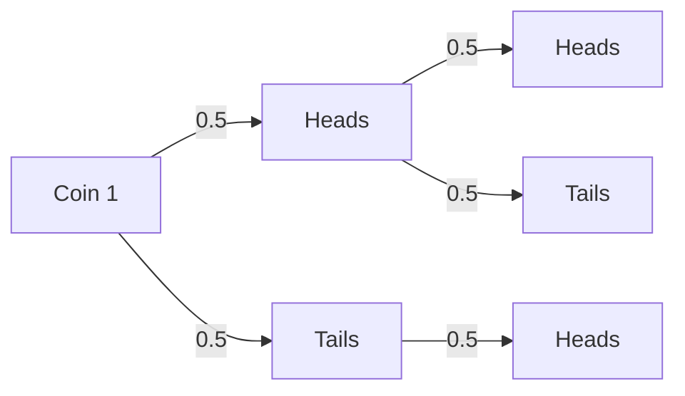

### 2023-09-27: Sampling Distributions 
1. sampling distributions 

### imagine: mean of 200p dice rolls 

-  if you were to roll a die 200 times, what would be the mean of the outcomes.  
-  roughly 3.5, right? that's the expected value, but the actual value probably would be 3.5 plus or minus a bit.  
-  the specific mean you get is one possible realization of a random process. many other means are possibl;e.  
-  crucially, there is a probability distribution over these possible means.  this distribution has a mean and standard deviation.  
-  we call this the sampling distribution for a sample mean.  

> we can graph that distribution:  
[visual of a plot]

-  it is centered around the actual mean: 3.5  
-  what is the dispersion of the distribution?  

### some important points:  
-  the sampling distribution is anormal distribution centered around the expected value of 3.5  
-  according to stata, the standard deviation of this distribution is .1216. this is the typical sampling error.  
-  in a normal distribution, 68.26% of the cases would fall within plus/minus .1216 of 3.5. In this simulation, the percentage is 68.8%  
-  95% of the cases would fall within plus/minus 1.96 *(.1216) of 3.5. In this simulation, the percentage is 95.1%

### Sample statistics and their distributions  
-  a sample statistics is any function computed from a sample  
    -  e.g. mean, standard deviation, the iqr, etc  
-  sample statistics are random variables, becuase their value depends on the composition of the random sample.  
-  sample statistics thus have probability distributions, which we call sampling distributions.  

> sampling distribution we do not see, it is theoretical -- reflects all the possible samples we could draw.  

### sampling distributions

-  a sampling distribution is a probability distribution over all the possible values of a sample statistic.  
-  for example, the sampling distribution for $\bar{y}$ gives the probabilities for all possible values of $\bar{y}$  

### what do sampling distributions give us?  
-  knowledge about sampling distributions allow us to make inferences about population parameters from sample statistics  
-  we don't know how well a specific sample reflects the population, but probability theory tells us how sample statistics tend to come out.  
-  we can thus estimate our level of precision.  

### central limit theoren  
repeated, random samples of size n drawn from any population with mean $\mu$ and variance $\sigma^2$ have the following characteristics:  
-  the sampling distribution of the sample mean $\bar{y}$ is approximately normal and centered upon the true population mean $\mu$.
-  the standard deviation of those sample means (i.e. random sampling error) is equal to:  

$$
\sigma_{\bar{y}} = \frac{\sigma}{\sqrt{n}}
$$

### the central limist theorem  

[visual of different sampling distributions]

the sampling distribution will be approximately normal even if the underlying population distribution is highly skewed.  

-  no matter what the population distribution looks like, as long as your sample size is at least 30. 

### the central limit theorem  
-  the necessary sample size for the sampling distribution to be approximately normal depends on the shape of the population distribution.  
    -  e.g. if the population distribution is highly skewed, the sample size must be larger  
-  usually n $\geq$ 30 is adequate for the sampling distribution to approximate normality whether or not the population is normal.  
-  if the population does have a normal distribution, however, the sampling distribution is normal regardless of size.  

$$
\sigma^2_{\bar{y}} = \frac{\sigma^2}{n} 
$$

### 2023-09-25: Probability Distributions 

### Overview 
-  probability distributions provide the probs with which a random variable takes on a particular value or falls into a specified range.  
-  a variable has a probability distribution (e.g. x)  
-  when we take a random sample of x, the sample distribution will tend to reflect this probability distribution (with error)  
-  stats from a random sample, such as $\bar{x}$, also have a probability distribution.  
-  the probability distribution of a sample statistic is called a sampling distribution.  

### Overview continued  

-  under the right conditions, the probability distributions for some sample stats, such as means or proportions, are normal.  
-  the normal distribution has specific properties.  
-  today we'll learn about these properties and how we can find the area under the curve for a stnadard normal distribution.  

#### why do we care? 
-  area under the curve measures the prob that our sample statistics will fall into a particular range.
-  probability theory gives us the ability to make an inference about our population based on the sample.  

### Normal Distribution  
 the normal distributino is just a prob distribution that has some important properties.  
 -  it is symmetric dith declining probability density as we move from the mean on either side.  
 -  it approximates the distribution of many variables in the real world.
 -  we can use it for purposes of statistical inference.

 Other symmetric distributions:
 - uniform distribution: equal probability of all values.
 - bimodal distribution: two peaks of equal height.  

### key parameters of the normal distribution

$$
f(y) = \frac{1}{\sigma \sqrt{2\pi}} e^{-\frac{(y - \mu)^2}{2\sigma^2}}
$$
the normal distribution has two key parameters:  
-  $\mu$ the mean of the distribution  
    -  changing $\mu$ moves the distribution left or right along the x-axis.
-  $\sigma$ standard deviation of the distribution  
    -  changing $\sigma$ changes the shape of the distribution from wide to narrow. 
-  changing the parameters changes it's shape  

### key parameters of the normal distribution, II 

-  about 68.26% of the area is within 1 standard deviation of the mean:  
$$
\mu = \pm \sigma
$$  

-  about 95.46% of the area is within 2 standard deviatoins (specifically 1.96) of the mean: 

$$
\sigma \pm 2\sigma
$$

## the standard normal distribution
### standardizing the normal distribution

-  so we know how commonly different values show up in a normal distribution.  
-  but for statistical inference, it is inconvenient to work with so many different normals.  
    -  knowing whether a case is unusual depends upon both $\mu$ and $\sigma$  
    -  to find the area under the curve, we would need to use integration.  
-  by standardizing the normal distribution to have $\mu$ = 0 and $\sigma$ = 1, we can compare data points more easily.  

### rescaling to the standard normal  

-  we can rescale the normal distribution to a standard normal distribution with $\mu = 0$ and $\sigma = 1$

### transforming raw data to z-scores  

-  a z-score is a standardized value for each observation.  
-  z-scores are calculated by subtracting the mean from each observation and dividing by the standard deviation.  

$$
z = \frac{y - \mu}{\sigma}
$$

Now that we're on the z-scale, we can find the area under the curve fairly easily.  

-  it tells us how many standard deviations the observation is from its mean.  
-  it's sign (+ or -) indicates whether the observation is above or below the mean.  

### Example: grade distribution  

-  suppose exam grades had a normal distribution with a $\mu$ = 75 and $\sigma$ = 5.  
-  interpreting a particular score, such as 80, is muhc easier when we know $\mu$ and $\sigma$.  
-  since z-scores are a function of $\mu$ and $\sigma$, they contain much more information than the raw score.  

$$
z = \frac{y - \mu}{\sigma} = \frac{80 - 75}{5} = 1.00
$$

### converting to the standard normal 

-  every exam score is converted to it's z score  
-  this shifts the entire distribution to have a mean of 0 and a standard deviation of 1.  

-  what was an 80 in the original scale becomes a 1.00 in the z-scale.  
-  what was a 65 becomes a -2.00 in the z-scale.  

$$
z = \frac{y - \mu}{\sigma} = \frac{65 - 75}{5} = -2
$$

-  if we have a z-score and want the original value, we can use the same formula in reverse. 
$$
y = \mu + z\sigma
$$

### benefits of the standard normal (z-scale)  

-  once it is converted to the standard normal scale. we can easily find the area under the curve using a z-table. 

### using the standard normal distribution for inference  

-  we know the probs with which a random variable will take on a particular value.  
        -  the variable will be in the range -1 to 0 about 68% of the time.  
        -  the variable will be in the range -1.96 to 1.96 about 95% of the time.  
        -  since the probability corresponds to the area under the curve, we can find the probability associated with any range of the variable.  

### using the standard normal  

with what prob will a normally distributed variable be more than 2 standard deviations above the mean and positive? 

### finding the area under the curve (using a z-table)  

-  finding the area under the curve involves integration  
-  since the standard normal probabilit density function is complex, we use computers or a z-table.  
-  a z-table typically (not always) provides the area above a positive z-score. (i.e. the right-hand tail).  
-  other areas are found using the fact that the distribution is symmetric and sums to 1.  
-  let's look up a z-score of 2.00  

1.  use the first two digits of the z-score to find the row.  
2.  use the third digit to find the column.  
3.  the number in the table is the area under the curve ABOVE that point.   

z-score = 2.00, area under the curve (upper tail) = .0228  

-  0.0228 is 2.28% of the area under the curve (to the right).  
-  the the probability that our variable is more than 2 standard deviations about it's mean is 0.0228  

### working with negative z-scores  

-  z-tables usually only have the positive side.  
-  for negative z-scores, we look up the corresponding positive z-score and subtract from 1.  
-  so, to look up our z-score of -1.00, use 1.00 on the z-table.  

z = 1.00, area under the curve (upper tail) = .1587.  
By the rule of symmetry, that same area appears under the curve to the left of -1.00.  

### going the other direction  
-  we can also use the z-table to look up trhe z-score associated with a particular area under the curve.  
-  look through the table to find the area that is closest to the probability of interest.  
-  work back to the top row and the leftmost column to find the z-score.  

e.g. for what z-score would the probability in the right hand tail be 0.40?  

Answer:  find 0.40 in the table, and the column and row values indicate that the z-score is between 0.25 and 0.26  

### summary: the big point  

-  normal distributions have very useful properties for statistical inference.  
-  we know the probabilities with which a normally-distributed variable is higher/lower than any given value.  
-  thus, if a sample statistic comes from a normal distribution, we have information about it's likely values.  
-  next, we learn that the probability distribution for sample means and proportions, under certain conditions, is normal.  

### review: binomial distribution  

#### the binomial distribution  

$$
P(x) = \frac{n!}{x!(n-x)!}\pi^x(1-\pi)^{n-x}
$$

We can use this distribution when:  
1.  the variable consists of two categories (e.g. yes/no, success/failure, etc.)  
2.  the probabilities with which an observation falls into each category or the other are constant across trials.  These probabilities are denoted $\pi$ and $1-\pi$.  
3.  the outcomes are independent across observations.  

### intuition behind the binomial distribution  
to obtain the probability of getting x heads from n tossess, we can multiply two formulas:  
1.  the joint probability of a permutation in which the outcome occurs x times n attempts.  

$$
\pi^x(1- \pi)^{n - x}
$$

2.  the number of possible combinations for that permutation.

$$
\frac{n!}{x!(n-x)!}
$$
where n! = (1)(2)(3)...(n)  

### 2023-09-17: Recap on Probability

- Probability is a long-run relative frequency.
- We can think of probability as being a proportion or the area of a sample space.
    - The proportion of times a random variable takes on particular values across repeated observations.

### 2023-09-17: Outline

1. Independence and conditional probability
2. Basic rules of probability
3. Probability tree diagrams
4. Contingency tables (Cross-tabulations)

**Note:** There is a handout called "Probability Three Ways" on Canvas.

### Independence

Events are independent if the occurrence of one event does not affect the probability of the other event.
- For instance, when rolling a pair of dice, the outcome of one die does not affect the outcome of the other die.

Events are dependent when the outcomes of one occurrence change the probability of the other.
- For example, observing a voter's party ID affects what we know about the probabilities of their candidate choice.

### Example

According to the Current Population Survey (CPS), about 60% of Americans aged 16 and over have a job. Most people in this age range also have a high school degree.
- If we randomly select a person from this population, P(Job) = 0.6 (still)

Independence:  P(job) remains 0.6 when selecting from those with a high school degree.

### Conditional Probability

- Conditional Probability: the probability of an event given that another event has occurred.
- The conditional probability of A given B is written as P(A|B), read as "the probability of A given B."

$$
P(A|B) = \frac{P(A \cap B)}{P(B)}
$$

- In the sample space, it is the area of A ∩ B divided by the area of B. (as a proportion of B).
- The denominator is the event known to have occurred. It is relevant to the sample space.

### What is P(Yes|Dem)?

$$
P(Yes | Dem) = \frac{.305}{.363} = .840  
$$

- The probability of a person being a Democrat given that they are a yes voter has risen to .84 from .646.
- This suggests that they are not independent from each other.

Example:  
P(No | Ind) = .115/.354 = .325  

### Testing for Independence  

If the conditional probability matches the unconditional probability, then the events are independent.  

$$
P(A|B) = \frac{P(A \cap B)}{P(B)}
 = P(A)
 $$

**This rule goes in both directions.**

### Party ID and Support for Minimum Wage are Not Independent

P(Yes) = .646 and P(Yes|Dem) = .305/.363 = .840

At least one conditional probability does not match the unconditional probability, so they are not independent.

### Basic Rules of Probability

1. Complement rule:  $P(\neg A) = 1 - P(A)$  
2. General rule of addition: $P(A \cup B) = P(A) + P(B) - P(A \cap B)$ 

### Multiplication: Dependent Events

When events A and B are dependent, their joint probability can be expressed as:
$$
P(A \cap B) = P(A)P(B|A)  \tag{or} P(A \cap B) = P(B)P(A|B)
$$  

### Multiplication Rule: Independent Events

When events A and B are independent, their joint probability can be expressed as:  
$$
P(A \cap B) = P(A)P(B) 
$$

### Flipping Coins  
$$
P(H,H) = P(H)P(H) = .5 * .5 = .25 
$$

### Probability Formulas

- $P(A \cup B) = P(A) + P(B) - P(A \cap B)$
- $P(A \cap B) = P(A)P(B|A) \\ \text{ or } P(A \cap B) = P(B)P(A|B)$
- $P(\neg A) = 1 - P(A)$
- $P(A|B) = \frac{P(A \cap B)}{P(B)}$ 

### Probability Tree Diagrams  

Tree diagrams can be helpful for visualizing the data (e.g., possible outcomes of two coin tosses).
The different paths through the tree represent different combinations of outcomes.

Sum up the appropriate joint probabilities to obtain the probability of a particular event.

### Tree Diagrams and Conditional Probability

Tree diagrams help illustrate conditional probabilities.
- The probabilities associated with each branch can be conditional upon assumptions about other events.
- Example: Tossing a coin and rolling a die.

### Contingency Tables

- Contingency tables represent the distribution of one variable across the values of another variable.
- These tables provide a basic way of summarizing and displaying data.
- They are particularly useful in examining relationships between categorical variables.

### 2023-09-17: Joint Probability Distributions, (the end)  

Properties of Joint Probability Distributions  
-  sample space is divided into all of the possitble (mutually exclusive) combinations of events.  
-  Easch joint probability is between 0 and 1.  
-  Row and column totals are called the marginal probabilities.  

### Question  
When rolling two die, what is the probability of the sum of the die being less than or equal to 4?  

-  there are several join outcomes (i.e. combinations of die rolls) that would produce this event.  
-  To get the total probability, we need to add up the probabilities of each of the events that produce a combination of dice that sum to 4 or less.  

P(1,1) + P(1,2) + P(2,1) + P(1,3) + P(3,1) + P(2,2) = 6/36 = 1/6  

### 2023-09-13: Sample Variance 

Sample Variance:  

$$
s^2 = \frac{\sum(y_i - \bar{y})^2}{n - 1}
$$

-  the formula for the sample varialnce uses y bar instead of mu_y, also it has n - 1 in the denom, rather than n.  
-  why not n? Two reasons:  
    1.  formual is more accurate as an estimator of the population variance.  
    2.  we only have n 1 independent piece of infomration about the variance. we "used up" some infomration to calculate $\bar{y}$, which is our estimate of $\mu_y$  

### accuracy of $s^2$ in estimating $\sigma^2$ 

- for the items in our sample, the squared deciations from $\bar{y}$ will be smaller than from $\mu_y$  
- accordingly, our sample variance would tend to underestimate the population variance.  
-  the sample variance formula corrects for this underestimate by making the denominator smaller.  
  
Sample variance: 
$$
s^2 = \frac{\sum(y_i = \bar{y})^2}{n = 1}
$$

### Degrees of Freedom  

- we divide n = 1 because we have n - 1 degrees of freedom when estimating a population variange with a sample variance.  
-  degrees of freedom measure how many independent pieces of information we have to calculate this statistic.  
-  the need to estimate some values required for calculating a statistic "uses up" some information.  
  

### Degrees of Freedom, pt. i  

- to estimate $\sigma^2$, the variance of the population, we first estimate $\mu$ using all n items in teh sample.  
-  then we use the same sample data agfain to calculate variance around the sample mean.  
-  but, given the sample mean, the value of the nth item is known as soon as we know the values of any n-1 other items.  

&rarr; **the nth item is not free to vary, so it does not provide information about the variance.**  

### Degrees of Freedom, pt. ii  
[fill in from slides tonight]  

### Key Formulas  

[fill in from slides tonight]  

### Skewness  
-  means assymetry of distribution.  
-  in one direction, it has a "long tail": a series of low probability outcomes that extend away from the buld of the data.  

Positive skew:  the data trail off to the positive side foteh scale (typically: mean > median)  
Negative skew: the data trail off to the negative side of the scale (typically: mean < median)  

### consequences of skewness  
-  we should think carefully about which measures of central tendency are appropriate.  
- in particular, the mean is less representative of the middle of the data.  
-  statistics that assume a symmetric distribution, such as the normal, may be problematic.  

### probability: part 1  

outline
1.  big picture  
2.  key elements of probability  
3.  basic rules of prob  
4.  gambler's fallacy  
5.  joint probs  
  

[fill this in tonight]  
GSS 2012: 
level of childcare spending in the us:
-  too little  
-  about right  
-  too much  

### the law of large numbers (Strong form)  

Example: roll a 3  
P(3) = 1/6  
Probability of rolling an even number; 
P(2)_P(4)+P6(^) =  

### 2023-09-11: Sampling Bias 

Two kinds of bias:  
-  selection  
-  non-response bias  

### Survey Weighting

-  collecting a perfect reporesentative sample is difficult and expensive.  
-  when a samples demographics do not match known population demopgrahics, we can apply weights to make adjustments.  
-  we need to have a clear idea of demographic characteristics of the population for weighting to work.  
-  [fill in from slides]  

### How survey weights work  

-  suppose 20% of respondents were aged 65+, when it should be 16% according to Census data.  
-  so, those below age 65 should be about 84% of the sample instead of 80%.  
-  for the qurvey questions where older people differ on average from younger people, statistics from the sample would be biased.  
-  each younger person would be weighted greater than 1 
[fill in the rest from slides]  

> This can be dangerous when doing weighting on political surveys.  

### Survey Methods Example: 2016 ANES  
-  uses a sophisticated set of sampling procedures to collect a sample that is useful for a vqariety of analyses.  
-  two independently drawn probability samples: one for a face-to-face survey, the second for internet-based survey.  
-  FTF target population: US citizens age 18+ living in the 48 contiquous states of the US plus DC.  

### FTF Sample: ANES  
-  multistage stratified cluster sample. Response rate was 50%.  
-  Primary Sampling Units (PSUs) were counties (or portions) of at least 05,000 in size.  

### Internet Sample  
-  Completely random sample from all residential addresses in a Postal Services database.  
-  Selected addresses contacted with letters, promises of cash payment, to recruit households into sample.  

### Other features: ANES 2016  
-  two waves: pre-election and post election waves.  
-  not all persons in pre-wave could be re-interviewed for post-wave.  
    -  90% for FTF survey; 84% for internet survey.  
-  FTF: sensitive quewtions could be completed in private on a laptop.  
-  users of the data can select either of the two surveys individually or use the combined sample. Correct weights should be used.  

### Descriptive Statistics  
1. Distributions 
2. Central Tendency 
3. Measures of Dispersion 
4. Variance and Standard Deviation 
5. Skewness  

### Distributions  
-  distribution shows the relative frequencies or probabilities of it's different values in a popoulation or sample.  
-  use descriptive stats to describe and summarixe the values  

### Categorical/Discrete Data  
-  frequencty distributions list possible values of a variable and the number of obs of each value.  
-  typically also show relative frequencies: proportions or percentages.  
-  Can be presented as tables of graphs  

### Continous Variables  
-  for continuous vars, we can divide the measurement scale inot a set of intervals  
-  frequency distribution givesd the number of observations in each interval.  
-  typically, intervals should:  
    -  include all possible values with no overlap  
    -  be equal in width.  

### Descriptive statistcs 
-  some important characteristics of sitributions  
    -  the "center" of the data (central tendency)  
    -  range of the data (dispersion)  
    -  variability (dispersion)  

-  specific types of descriptive stats we can use depend on the measurement levelof teh variable and whether it is discrete or continuous.  

### central tendency  

-  refers to what is "average" or typical in the data. 
-  three measures: mean, median, mode  
-  which one is most appropriate for a particular variable depends on teh context.  

### mathematical notation  

suppose population is of size N and we observe the value of the variable y for all members of a population.  

-  we can index these obs with a subscript as: $y_1, y_2, ... y_N$ (Capital $N$ means entire sample)  
-  then we can refer to $y_i$ as the value for y for the $i$th item of the population.  
-  using the greek letter $\Sigma$ (sgma) as the operator for the sumn of a set of values, the sum of y in the population is:  

[put the summation notation here]  

## the mean  

-  mean is the arithmetic center of a distribution. it commonyl dets called the "AveragE"  
-  population mean is represented by the parameter $\mu$ (mu). We often seek to estimate this mean.  
-  more broadly, the mean is the expected value of a variable. for a discrete variable:  
$$
E[y_i] = \mu_y = \Sigma y_ip(y_i)
$$

-  the expected value of a probability weighted-average. the sum of each valuew times the prob of observing that value.  

### formula for the mean  
note that in a population of zie $N$, the weight on each element is 1/n, which means L:  
$$
[copyt this formula from the notes]
$$

The the forumla for the mean of y in a population of size N is: 

[sumj everything and then dviide by that number]

### T?he sample mean  
in the sample we signify the mean of a variable by putting a bar on top of it: e.g. $\bar{y}, \bar{x}$.  

The sample mean is th4e sum of each value of a variable times the prob of randomly selecting that bvalue from the sample:  

$$
\bar{y} = \Sigma y_i p(y_i) 
$$

Since the probability of randomly selected elements is 1/n, we can write the formula for the sample mean as:  
$$
\bar{y} = \Sigma y_i (\frac{1}{n}) = \frac{1}{n} [finish]
$$

### median  
-  the observation that falls in the middle of an ordered distribution  
-  the 50th percentile position  
-  available for ordinal or interval level values, not for nominal variables.  

### finding the median  
-  rank the data in our sample such that the lowest item is y_i, the next is y_2, etc, the highest is y_n.  
-  location the observation $y_{(n+1)/2}$  
-  if n is odd, there is a single value in the middle,. thisis the median.  
-  if n is even, (n+1)/2 is between the two values. 

### mean vs median  
-  mean conveys infomration about the values of hte datysa. medians look only at rank ordering.  
-  mean are sensitibve to exterme values. median are much less sensitive to exte3me values.  
-  when a distribution is highly skewed,m the mesian is likely the better measure of what is "typical"  

> mode: might not be super informative for an interval level variable.  

### meaures of dispersion  
four basic measure sof dispersion:  
1.  range  
2.  interquartile range  
3.  variance  
4.  standard deviation  

### dispersion for nominal level variables  
-  we cannt use any of these four measurews  
-  instead we can describe dispersion in more qualitative terms  
-  are ther emore observations concentrated in vertain vategories, or are they spread more evenly across categories.  

### range  
-  difference beytween the largest and the smallest observation in the data.  
-  it may differ from the ful range of the variable itsent; not all balues may be osbserved.  
-  the range is a fairly crude measure.  
    -  only considers largest and smallest observations  
    -  it is sentitive to extreme values  

### percentiles  
to understand interquartile ranges, we need to first understand percentiles.  
**percentile**: a score below which a specific percentage of th4e data gfall.  
-  the nth percentile is a score velow which lies n percent of the distribution.  
-  e.g. student distance from schoo. The 55th percentiile would be someone who was further than 55% of the other students.  

### notable percentiles  
-  50th mercentile is the median.  
-  25h percentile is the lower or first quartile (Q1)
-  75th percentile (Q3): spearates the lower 75% and the highest 25% of the data.  

### RELATED TERMS:  
-  QUINTILES: DIVIDETHE DATA INTO 5 EQUALL;Y SIXED BINS. 
-  deciles: divided data into 10 bins.  
-  quantiles: general term for dividing data into equally sized subsets.  

### interquartile range (IQR)  
-  distance between the boundaries defining the middle 50% of the distribution.  
$$
IQR = Q_3 - Q_1
$$  
-  IQR is based on rank order and increases as variability of the distribution increases.  
0  unlike the range, IQR is not sensitivbe to extreme outliying values.  
  
### calculating the IQR  
1.  put the data into numerical order  
2.  divide the data into two eually sized groups -- low and high -- at the median.  
    -  when n is even, the sample breaks neatly into 2 equal groups.  
    - when n is odd, the median is a data point. we include it in both to make them equal in size.  
3.  find the median of each group.  
4.  [finish from sthelides]

### IQR for ordinal categories  
-  expressing IQr as a distance does not make sense for ordinal vategories.  

### variance and standard deviation*  
*important  
in any situation where you can't find the mean, you also will not be able to calculate the standard deviation.  

### measures of variability  
-  variance and standard deviation are commonl-used measures of th ebariability of the data.  
-=  both measures degree of variablion from the mean.  thust they are only for interval-level variables.  

-  standard deviation: thge typical distrance between a randomly chosen data point and the mean of the distribution.  
$$
\sigma = E[y_i = \mu_y]
$$

-  the bigger $\sigma$ (sigma), the more widely trhe data are spread out from the mean.  

### deviation from the center  
- why do we use the stqandard deviation? how is it estimated?  
-  it might seem like calculation the average deviation from the mean would be useful for measuring variability... but trhe sum of all deviations from the mean is 0, and thus to is the average deviation.  
$$
[insert formula here]
$$

### squared deviations from the mean  
-  sum of the squared deviations from the mean is called the sum of squares  

### Sum of squares  

$$
Population SS = \Sigma (Y_i - \mu_y)^2
$$

> the larger the deviations about the mean, the larger the sum fo squares.  

### Variance  
-  sum of sqwuarres measures how much the values of y_i deviate from the mean  
-  the typical of expected squared deciation is called the variance  
$$
\sigma^2 = E[(y_i - \mu_y)^2]
$$

### calculating the population variance  
$$
Population variance: \frac{\Sigma(y_i - \mu_y)^2}{N}
$$

### standard deviation ($\sigma$)  

### 2023-09-06: Levels of Measurement 

-   Nominal-Level: Scale of measurement is a set of categories that has no inherent order.  
    -  Religious affiliation, gender, occuptation, etc.    
-   Ordinal Level: Scale of measurement is a set of categories ordered along some dimension.  
    -  ideology scale, likert scale, etc.  
-   Interval Level: the scale of measurement has units with a specific numerical distance between them.  
    -  time, distance, income, etc.  
    -  ratio variables: a subset of interval level variables with a true 0.  

#### Continuous vs. Discrete 

[Fill this in later]  

### Characteristics of Variable Values:  

These characte4ristics caputure different facets of variable values. There are some key relationshpis, however:  
-   Categorical vaiables are either nominal or interval level.  
-   Etc. [Fill in based on the slides]  

### Some Examples  
-   ?Unless a varialbe is interval-level, we cannot calculat eit's mean.  
-   If a variable is continuous, we would generally use a histogram rather than a bar chart to show it's distribution.  
-   If a variable is categorical, it makes sense to think about the proportion of the sample that falls into each categroy.  

Notes: Means don't make sense for [___] variables. 

### Measurement levels and Central Tendendcy

The only central tendencythat makes sense for a nominal level variable is &rarr; **mode**  
-   Ordinal variable &rarr; **mode and median**  
-   Interval vars &rarr; **mode, median and mean**  

### A special type: Dichotomous Variables  
-   A special case of nominal level vars in which there are only tweo-values, usually 1 and 0.  
      1 = the case belongs to the category of interest  
      0 = does not belong to the category of interest  

-   Examples : emplkoyed/not employed. Democrat/not a democrat; program participant/not a participant.  
-   They are commonly called dummy variables.  
-   Dichotomous variables can be used in some situations where other nominal variables can't be used.  
    -  Taking th emean of a dichotomous varialbe witll give you the proportion.  

### Measurement levels in practice  

We have leeway when working with data.  
-   e.g. we might treat an ordinal variable as interval level in certain cases. why?  
-   e.g. we might convert an interval level variable (like income) into ordinal categories. why?  
-   e.g. we might treat a discrete variable with many, many values (like # of children in a school) like it is continuous. Why?  
-   e.g. we might chose to record a continuous variable (like age) as if it is discrete.  why?  

Note: There is some wiggle room for all these variables. It matters what maekse sense in context and practice.  

### Some Specific Measyres: Indexes  
-   An index is a multi-term measure. It can be used to caputue several dimenasions of a concept  
-   For example: an index of the degrtee of environmental protection in a country.  
-   There could be a set of different types of encvironmental lawds that a country may or may not have.  
-   For each type of law that is present in a country, add a point to teh index.  

### Propoerties of a good index  
-   Each of the itemas is a valid measure of the concept of interest.  
-   the weights placed on each item reflect their importance for trhe concept., typically, they are weighted equally.  
-   the components of the index should be empirically related to ech other (i.e. correlated with each other).  
-   the correlation between any two elements should not be affected by the value of a third element.  
-   the infex performs well in validation tests: it is correlated with other variables it should correlate with,.  

### Scales  
-   are sometimes confused with indexes becauyse they may be conposed of multiple items,.  
-   one differnece: scales are focused on the intensity of hte items. the elements of a scale reflect different intensities.  
-   e.g. statements appear in order of weak to strong beliefs, where someone who agrees with a strong statement would generally agree with all weaker ones.  
-  some common examples: likert and guttman scales.  

### likert scales  
-  a sclae built from a series of statements in which a person is asked about their level of agreement with each statement.  
-  for each statement, the possible responses are "strongly disagree," "neither agrree nor disagree," "agree" and strongly agree"  
-  assign points from 1 to 5 (or 0 to 4) and calculate the total score across all statements.  
-  oftentimes, researchers ask about the agreement with only one statement and call it a likert scale. that's not fully what likert had in mind.  

### guttman scales  
-  there is a series of statements that probe at how strongly a persons beliegfs go on a particular issue.s  
-  e.g with abortion rights, the statements may range from:  
   -  abortion should nebver be permitted undet any circumstances.  
   - abortion should be permitted only when a mothers life is in danger.  
   -  etc. etc  

### there are many other's  
-  these are the most common types of indexes and scales   
-  we will see many others this semester.  

## Sampling  
### 2023-09-06  

### Otuline  
1.  methods of sampling  
2.  random sampling error and source sof bias  
3.  survey weighting  

### Populations v.s samples  
**Populations:** full set of ccases that we are tring to analyse. the univers e of subject.s  
-  examples: countries of the world, american voters, etc.  
-  a numerical summarty of some characteristic of the population is a _parameter_.  

**sampkle:** as subset of the population.  
-  a numerical summary of some characteristic from a sample ios called a _Statistics_  

Note: Samples can depict non-existent populations. They could be _potential_ populations.  
Ex. People in Congress represent the potential sampkle of Congress, not the only congress that could ever be.  

### Pop vs. Samples 2  
The reason we go out and gather _statistics_ is bevause we are curious about parameters.  
-  statistics are things we can calculate and know with certainty.  
-  paramters are things about which we can make educated guesses.  

### Hypothetical populations  
-  a popuilation may be hypotheticla. 
-  sample of all participants in a pilot program represents a hypothetical poulation of all potential participants.  

### two broad categories of sampling  
-  nonprobability sampling: wehn situation do not permit random samples  
   -  convenience sample: use readily available subjects.  
   -  purposive sample: select meaningful/relevant cases.  
   -  snowball samples: use some sample members to help id others  
   -  quota saples: info about proportional sizes of poulations subghroupos used to create quoptes for subsample size.  
-  probability sampling: utilizxe properties of random selection to some degree  

ref: _babbie, the practive of social research, 11th edition._

### probability sample design  
there are many types of sample designs.  
-  simelpe random sample (SRS): every ind. has equal probl of selection.  
-  systematic random sample: select every _n_ th item from sampling frame.  
-  stratified random sample: pop  is divided into strata. sample from within strata.  
-  cluster sampling: pop divided into clusterns, rnadomly select clusters, randomly select individuals within clusters.  

the latter three are more complicated sampling technieques used when SRS is not workable.  

### stratified sampling  
-  strata are identifiable subpopulations that are of known sizes. (e.g. regions, demo categories, etc)  
-  random sampling within strata ensures the overall sample contains members from each subpopulation  

- **potential advantages**: reduced variability od ample statistics. easier/cheaper than SRS, facilitatelsa analysis of small subgroups.  
  -  oversmapling of smaller subpops provides better ability to maek inferences about these groups.  

- **potential disadvantages**: strata must be identifiable and mutually exclusive,; inaccurate info about strata sizes can worsen estimate.s  

### Cluster sampling  
-  a multi-stage process in which population is [fill in the rest from the slides]  

### theyory vs. reality  
-  basic stats theory typically assumes a random saplme: each member of population has equal prob of selection.  
-  this is diffivult to acehive in raliery.  
-  we thus use various methods to help aceive representatitveness while preserving as much randomness as possible.  
-  in the end, a representative sample is a central goal. the methods we use to get there have good/bad consequences.  

## sampling error 
-  becuase stats are cauclated from sampkles, and not the population they contain samplking error.  
-  sampling error: the error that occurs when we use a sample statsitic to estimate the bvalues of a population paramter.  
e.g. the mean age of students inthis class based upon a sample of 10 students.  

-  **probability theory helps us understand sampling error. across repeated random samples, there errors flucturate faroudn zero.**  

### sourcesof bias in samples  
random sampleing error is expected, and its properties are well-understood. eror due to bias, is more problematic.  
-  selection bias: non-random sampling nthat produces systematic differences between thosei in teh sample and those not in the sample. also called sampling biaas.  
-  nonresponse bias: there are systematic diffs in the population in terms of who is willing to participate in the study or nswer a particular question.  

### example: nonresponse bias  
suppose polling firm wants 1000 respondents  

|    | scenarioa 1 | scenario 2 | 
|----|-------------|------------|
| response rate    | candidate a: 10%  | candidate a: 10% |  
|    |  candidate b: 10%  | candidate b: 11% |  
| phone calls neede | 10,000 | 9,552 |  

[finish this later based on the slides]