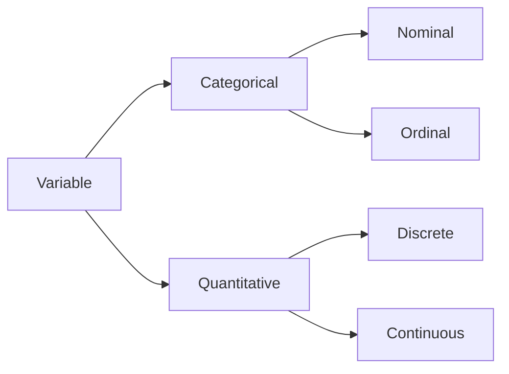

### Assessing measurement tools  

-  reliability: whether a measure will _consistently_ measure a concept (regardless of accuracy)  
-  validity: whether a measure will _accurately_ measure a concept.  
-  If a measurement is not reliable, it has validity issues.  

#### Examples:  

### Sampling Error  
-  **Sampling Error**:  
    -  Error that occurs when we use a sample statistic to estimate the value of a population parameter.  
        -  Random sampling error is expected, and it's properties are well understood.  
        -  Error due to bias, however, is more problematic.  

### Bias  
-  **Selection bias/Sampling Bias**:  
    -  Can occur when non-random sampling produces systematic differences between those _in and out_ of the sample.  
-  **Response Bias**:  
    -  Can offur when respondents may not be moticated to a question inacurately or untruthgfully.  
-  **Non-response Bias**:  

E.g. Gender is a categorical variable, which is nominal (categories have no order), the variables are discrete, and the available measure of central tendency is mode.  

## 2023-09-15  

### problem set 2  
-  due tuesday september 19th  
-  notes:  
    -  aner2016 (not 2020!)  
    -  show all work when solving problems  
    -  probability - check if it indivates proportion or percentage.  
    -  decimal places will be indicated if there is a preference.  
        -  exception:  proportions should be to 2 places  
-  turn in on canvas  
    -  solutions to questions  
    -  do file/rscript  

### bias  
-  selection bias/sampling bias:  
    -  can offucr when non-random sampling produces systematic differences between those in and out of the sampel.  
-  response bias:  
    -  can occur when respondents may not be motivated to answer a question accurately or answer untruthfully.  
-  non-response bias:  
    -  can occur when there are systematic differences in terms of who is willing to participate in a survey or answer a question, **once they are part of a sample**.  

### Variables  
[insert chart picture here ]  

### sample v.s. population notation  

|  |  |  |
|--|--|--|
|  | sample | population | 
|mean|$\bar{y}$|$\mu_y$ | 

### calculating means with frequency tables  

Method 1: traditional method  
1.  add up all the values  
2.  divide by n  

Method 2: calculate a weighted average  
1.  multiply each value by it's proportion  
2.  add up the subsequent products.  

### joint frequency tables  
-  reading a joint frequency table  
    -  two variables -- listed at the lest and top of the table.  
    -  frequency in the middle  
    -  where is the proportion/percentage?  
        -  calculate it  
        -  sometimes tables will have proportions instead of frequencies.  

### probability notatin  
-  S = {A,B,C} &rarr; sample space S with possible outcomes A, B, C  
-  Pr(A) &rarr; the probability of outcome A  
-  A and B = A $\cap$ B = the intersection of A and B &rarr; **what the 2 events have in common**.  
    -  we often refer to the PR(A $\cap$ B) as the joint probability.  

### Note:  
-  if you're asked for a proportion, express as a decimal, e.g. 0.05  
-  if you're asked to provide a percentage, express it as a percent, e.g. 5%  

## 2023-09-29  

### sample and population distribution  
-  we have worked with sample and population distributions 
    -  the height of the bars correspond to the frequency of the values  

### sampling distribution  
-  the distribution of a sample statistic for a sample of size n taken repeatedly  
    -  the mean of a sampling distribution is the mean of means.  
-  **standard error**: the standard deviation of our sampling distribution. over repeated random samples of the same size, this is our agerage distance from the true value of the population parameter.  
    -  this would show a distribution of the mean number of credit hours of repeated samples of ford students  

For samples, you use standard deviations, for populations, you use standard errors.  

### Sample vs sampling distributions 
-  it is **very** important to understand the distinction between a sample and sampling distribution  

### sample/population vs. sampling distributions  
-  the sampling distribution will be approximately normal, **even if** the underlying population is highly skewed, u-shaped, or some other shape.  

### Central Limit Theorem

-  the necessary sample size for the sampling distribution to be approximately normal depends on the shape of the population distribution.  
    -  the more skewed the population distribution, the larger the sample size needed for the sampling distribution to be approximately normal. 
        -  e.g. if the population distribution is highly skewed, the sampling distribution will be approximately normal for a sample size of 30 or more.

### probability distribution  
-  probability distributions are also defined by parameters that describe their center and variability.  
-  the the right, the mean is 100 and a standad deviation from the mean is 10.  
-  the area under the curve is the probability of a getting each value.  

### normal distribution  
-  a z-score is a standardized calue for each observation  

### calculating z-score  
-  z = (x - $\mu$) / $\sigma$  
    -  x = value  
    -  $\mu$ = mean  
    -  $\sigma$ = standard deviation

-  remember: a z-score tells you how many standard deviations you are from the mean.  
    -  just converts the distance from the mean from the original units of measure to standard deviations.  

### quiz  

prob a person has covid = 0.75  
prob a person has covid and tests positive = 0.3
what is the probability that a person has covid?  

P(positive | covid) = 0.75  
